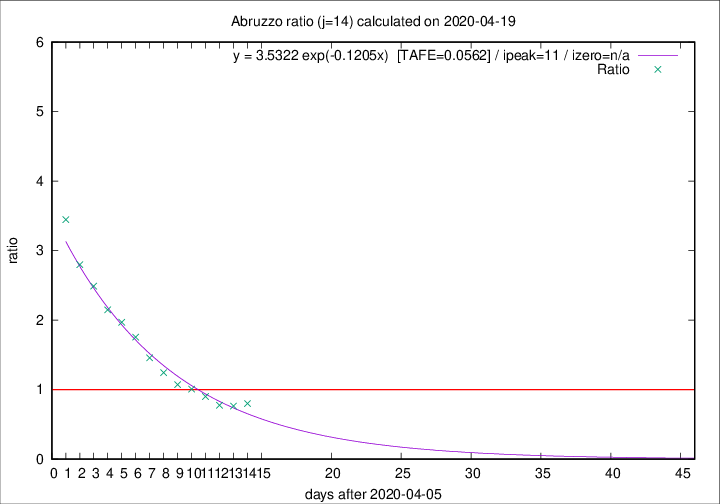

# Abruzzo

Data source: https://raw.githubusercontent.com/pcm-dpc/COVID-19/master/dati-json/dpc-covid19-ita-regioni.json

Delta days analysis (j): 14

Analyses for other values of j for 2020-04-19 are avalable [here](../2020-04-19/README.md)

Analyses for Abruzzo for previous dates are avalable [here](../README.md)

## Fitting 
|fit type|best fit equation|tafe|tfe|ipeak|izero|
|-------|-----|--------|------|---|---|
|exp|y = 3.5322 exp(-0.1205x)  [TAFE=0.0562]|0.0562|0.0031|11|n/a|

## Data
|Date|Daily deaths|Cumulated deaths|Deaths in the last 14 days|Deaths in the 14 days before|ratio|
|----|----------|-----------|-------|--------------------|-----|
|2020-04-19|5|258|100|125|0.8000|
|2020-04-18|7|253|100|131|0.7634|
|2020-04-17|3|246|100|129|0.7752|
|2020-04-16|3|243|110|122|0.9016|
|2020-04-15|8|240|117|116|1.0086|
|2020-04-14|8|232|117|109|1.0734|
|2020-04-13|12|224|122|98|1.2449|
|2020-04-12|6|212|124|85|1.4588|
|2020-04-11|8|206|130|74|1.7568|
|2020-04-10|4|198|130|66|1.9697|
|2020-04-09|15|194|131|61|2.1475|
|2020-04-08|7|179|127|51|2.4902|
|2020-04-07|3|172|126|45|2.8000|
|2020-04-06|11|169|131|38|3.4474|

[Download data as CSV](COVID-19_abruzzo_j14_2020-04-19.csv)

Generated April 19th, 2020 at 18:42:39 UTC+0200 with https://github.com/robianc/COVID-19
