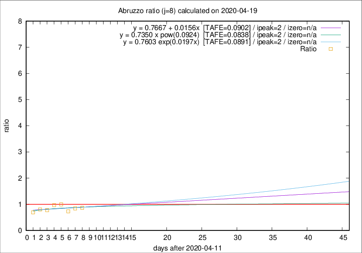

# Abruzzo

Data source: https://raw.githubusercontent.com/pcm-dpc/COVID-19/master/dati-json/dpc-covid19-ita-regioni.json

Delta days analysis (j): 8

Analyses for other values of j for 2020-04-19 are avalable [here](../2020-04-19/README.md)

Analyses for Abruzzo for previous dates are avalable [here](../README.md)

## Fitting 
|fit type|best fit equation|tafe|tfe|ipeak|izero|
|-------|-----|--------|------|---|---|
|linear|y = 0.7667 + 0.0156x  [TAFE=0.0902]|0.0902|0.0126|2|n/a|
|exp|y = 0.7603 exp(0.0197x)  [TAFE=0.0891]|0.0891|0.0062|2|n/a|
|pow|y = 0.7350 x pow(0.0924)  [TAFE=0.0838]|0.0838|0.0054|2|n/a|

## Data
|Date|Daily deaths|Cumulated deaths|Deaths in the last 8 days|Deaths in the 8 days before|ratio|
|----|----------|-----------|-------|--------------------|-----|
|2020-04-19|5|258|52|60|0.8667|
|2020-04-18|7|253|55|65|0.8462|
|2020-04-17|3|246|52|71|0.7324|
|2020-04-16|3|243|64|64|1.0000|
|2020-04-15|8|240|68|70|0.9714|
|2020-04-14|8|232|63|81|0.7778|
|2020-04-13|12|224|66|82|0.8049|
|2020-04-12|6|212|59|85|0.6941|

[Download data as CSV](COVID-19_abruzzo_j8_2020-04-19.csv)

Generated April 19th, 2020 at 18:42:39 UTC+0200 with https://github.com/robianc/COVID-19
