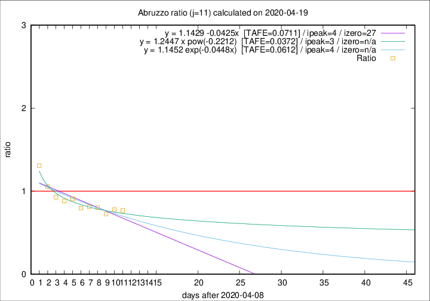
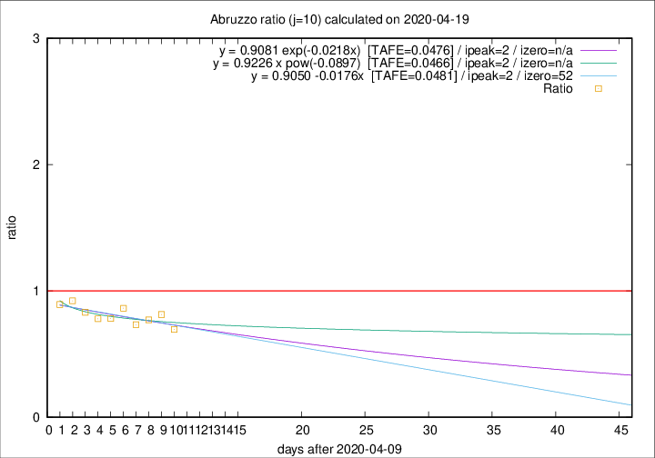

# Abruzzo

Data source: https://raw.githubusercontent.com/pcm-dpc/COVID-19/master/dati-json/dpc-covid19-ita-regioni.json

Estimates in this page were made on 19/4/2020 with data available until 19/04/2020.

## Summary 

### Peak estimate 
|j|linear [TAFE]|exponential [TAFE]|power law [TAFE]|details|
|---|----|-----------|---------|-------|
|7|15/4/2020 [TAFE=0.0870]|15/4/2020 [TAFE=0.0867]|15/4/2020 [TAFE=0.0926]|[analysis](COVID-19_abruzzo_j7_2020-04-19.md)|
|8|14/4/2020 [TAFE=0.0902]|14/4/2020 [TAFE=0.0891]|14/4/2020 [TAFE=0.0838]|[analysis](COVID-19_abruzzo_j8_2020-04-19.md)|
|9|13/4/2020 [TAFE=0.0542]|13/4/2020 [TAFE=0.0540]|13/4/2020 [TAFE=0.0537]|[analysis](COVID-19_abruzzo_j9_2020-04-19.md)|
|10|12/4/2020 [TAFE=0.0481]|12/4/2020 [TAFE=0.0476]|12/4/2020 [TAFE=0.0466]|[analysis](COVID-19_abruzzo_j10_2020-04-19.md)|
|11|13/4/2020 [TAFE=0.0711]|13/4/2020 [TAFE=0.0612]|12/4/2020 [TAFE=0.0372]|[analysis](COVID-19_abruzzo_j11_2020-04-19.md)|
|12|15/4/2020 [TAFE=0.1222]|15/4/2020 [TAFE=0.0899]|14/4/2020 [TAFE=0.0500]|[analysis](COVID-19_abruzzo_j12_2020-04-19.md)|
|13|16/4/2020 [TAFE=0.1359]|16/4/2020 [TAFE=0.0782]|15/4/2020 [TAFE=0.0737]|[analysis](COVID-19_abruzzo_j13_2020-04-19.md)|
|14|17/4/2020 [TAFE=0.1494]|17/4/2020 [TAFE=0.0562]|17/4/2020 [TAFE=0.1160]|[analysis](COVID-19_abruzzo_j14_2020-04-19.md)|

Best estimator is pow with j=11 (TAFE=0.0372)
Corresponding peak date estimate is 12/4/2020 (ipeak 3)

Peak date range estimate: 11/4/2020 - 20/4/2020

### End estimate 
|j|linear [TAFE/TFE]|exponential [TAFE/TFE]|power law [TAFE/TFE]|details|
|---|----|-----------|---------|-------|
|7|20/6/2020 [TAFE=0.0870]|-|-|[analysis](COVID-19_abruzzo_j7_2020-04-19.md)|
|8|-|-|-|[analysis](COVID-19_abruzzo_j8_2020-04-19.md)|
|9|-|-|-|[analysis](COVID-19_abruzzo_j9_2020-04-19.md)|
|10|1/6/2020 [TAFE=0.0481]|-|-|[analysis](COVID-19_abruzzo_j10_2020-04-19.md)|
|11|-|-|-|[analysis](COVID-19_abruzzo_j11_2020-04-19.md)|
|12|-|-|-|[analysis](COVID-19_abruzzo_j12_2020-04-19.md)|
|13|-|-|-|[analysis](COVID-19_abruzzo_j13_2020-04-19.md)|
|14|-|-|-|[analysis](COVID-19_abruzzo_j14_2020-04-19.md)|

Best estimator is linear with j=10 (TAFE=0.0481)
Corresponding end date estimate is 1/6/2020 (izero 52)

End date range estimate: 10/4/2020 - 17/6/2020

Generated April 19th, 2020 at 18:42:39 UTC+0200 with https://github.com/robianc/COVID-19
