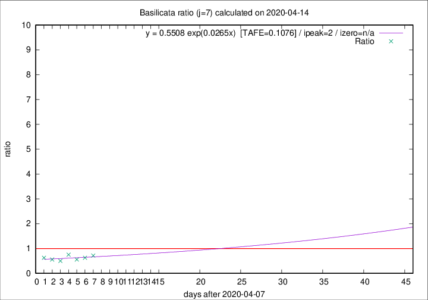

# Basilicata

Data source: https://raw.githubusercontent.com/pcm-dpc/COVID-19/master/dati-json/dpc-covid19-ita-regioni.json

Delta days analysis (j): 7

Analyses for other values of j for 2020-04-14 are avalable [here](../2020-04-14/README.md)

Analyses for Basilicata for previous dates are avalable [here](../README.md)

## Fitting 
|fit type|best fit equation|tafe|tfe|ipeak|izero|
|-------|-----|--------|------|---|---|
|exp|y = 0.5508 exp(0.0265x)  [TAFE=0.1076]|0.1076|0.0076|2|n/a|

## Data
|Date|Daily deaths|Cumulated deaths|Deaths in the last 7 days|Deaths in the 7 days before|ratio|
|----|----------|-----------|-------|--------------------|-----|
|2020-04-14|1|19|5|7|0.7143|
|2020-04-13|0|18|5|8|0.6250|
|2020-04-12|1|18|5|9|0.5556|
|2020-04-11|2|17|6|8|0.7500|
|2020-04-10|0|15|4|8|0.5000|
|2020-04-09|1|15|5|9|0.5556|
|2020-04-08|0|14|5|8|0.6250|

[Download data as CSV](COVID-19_basilicata_j7_2020-04-14.csv)

Generated April 14th, 2020 at 19:16:04 UTC+0200 with https://github.com/robianc/COVID-19
