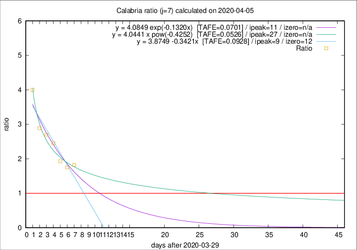

# Calabria

Data source: https://raw.githubusercontent.com/pcm-dpc/COVID-19/master/dati-json/dpc-covid19-ita-regioni.json

Delta days analysis (j): 7

Analyses for other values of j for 2020-04-05 are avalable [here](../README.md)

Analyses for Calabria for previous dates are avalable [here](../../README.md)

## Fitting 
|fit type|best fit equation|tafe|tfe|ipeak|izero|
|-------|-----|--------|------|---|---|
|linear|y = 3.8749 -0.3421x  [TAFE=0.0928]|0.0928|0.0056|9|12|
|exp|y = 4.0849 exp(-0.1320x)  [TAFE=0.0701]|0.0701|0.0031|11|n/a|
|pow|y = 4.0441 x pow(-0.4252)  [TAFE=0.0526]|0.0526|0.0017|27|n/a|

## Data
|Date|Daily deaths|Cumulated deaths|Deaths in the last 7 days|Deaths in the 7 days before|ratio|
|----|----------|-----------|-------|--------------------|-----|
|2020-04-05|7|56|31|17|1.8235|
|2020-04-04|4|49|28|16|1.7500|
|2020-04-03|4|45|27|14|1.9286|
|2020-04-02|3|41|27|11|2.4545|
|2020-04-01|2|38|27|10|2.7000|
|2020-03-31|5|36|26|9|2.8889|
|2020-03-30|6|31|24|6|4.0000|

[Download data as CSV](COVID-19_calabria_j7_2020-04-05.csv)

Generated April 10th, 2020 at 17:26:10 UTC+0200 with https://github.com/robianc/COVID-19
