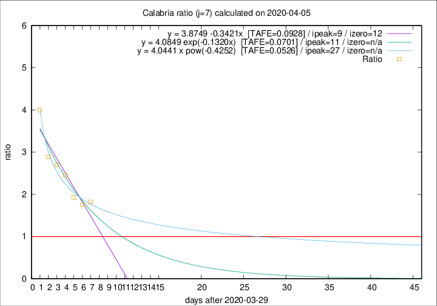

# Calabria

Data source: https://raw.githubusercontent.com/pcm-dpc/COVID-19/master/dati-json/dpc-covid19-ita-regioni.json

Estimates in this page were made on 12/4/2020 with data available until 05/04/2020.

## Summary 

### Peak estimate 
|j|linear [TAFE]|exponential [TAFE]|power law [TAFE]|details|
|---|----|-----------|---------|-------|
|7|8/4/2020 [TAFE=0.0928]|10/4/2020 [TAFE=0.0701]|26/4/2020 [TAFE=0.0526]|[analysis](COVID-19_calabria_j7_2020-04-05.md)|
|8|10/4/2020 [TAFE=0.1134]|14/4/2020 [TAFE=0.1104]|-|[analysis](COVID-19_calabria_j8_2020-04-05.md)|
|9|9/4/2020 [TAFE=0.0673]|14/4/2020 [TAFE=0.0755]|-|[analysis](COVID-19_calabria_j9_2020-04-05.md)|
|10|6/4/2020 [TAFE=0.4177]|11/4/2020 [TAFE=0.2215]|8/5/2020 [TAFE=0.1540]|[analysis](COVID-19_calabria_j10_2020-04-05.md)|
|11|7/4/2020 [TAFE=0.2997]|14/4/2020 [TAFE=0.2177]|-|[analysis](COVID-19_calabria_j11_2020-04-05.md)|
|12|-|-|-||
|13|-|-|-||
|14|-|-|-||

Best estimator is pow with j=7 (TAFE=0.0526)
Corresponding peak date estimate is 26/4/2020 (ipeak 27)

Peak date range estimate: 30/3/2020 - 11/5/2020

### End estimate 
|j|linear [TAFE/TFE]|exponential [TAFE/TFE]|power law [TAFE/TFE]|details|
|---|----|-----------|---------|-------|
|7|11/4/2020 [TAFE=0.0928]|-|-|[analysis](COVID-19_calabria_j7_2020-04-05.md)|
|8|-|-|-|[analysis](COVID-19_calabria_j8_2020-04-05.md)|
|9|12/4/2020 [TAFE=0.0673]|-|-|[analysis](COVID-19_calabria_j9_2020-04-05.md)|
|10|-|-|-|[analysis](COVID-19_calabria_j10_2020-04-05.md)|
|11|-|-|-|[analysis](COVID-19_calabria_j11_2020-04-05.md)|
|12|-|-|-||
|13|-|-|-||
|14|-|-|-||

Best estimator is linear with j=9 (TAFE=0.0673)
Corresponding end date estimate is 12/4/2020 (izero 15)

End date range estimate: 28/3/2020 - 12/4/2020

Generated April 12th, 2020 at 16:28:18 UTC+0200 with https://github.com/robianc/COVID-19
