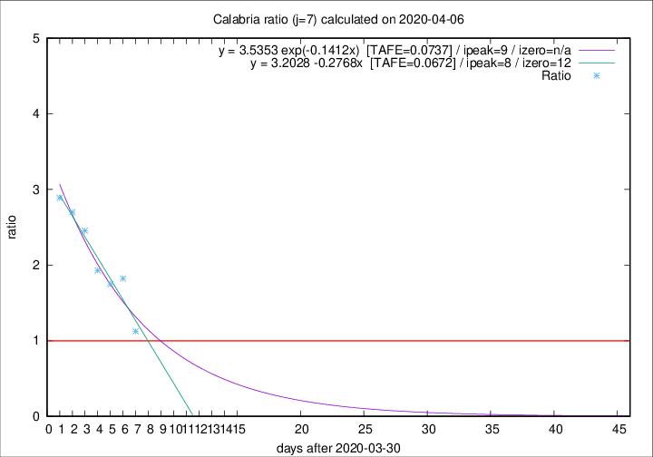

# Calabria

Data source: https://raw.githubusercontent.com/pcm-dpc/COVID-19/master/dati-json/dpc-covid19-ita-regioni.json

Delta days analysis (j): 7

Analyses for other values of j for 2020-04-06 are avalable [here](../2020-04-06/README.md)

Analyses for Calabria for previous dates are avalable [here](../README.md)

## Fitting 
|fit type|best fit equation|tafe|tfe|ipeak|izero|
|-------|-----|--------|------|---|---|
|linear|y = 3.2028 -0.2768x  [TAFE=0.0672]|0.0672|0.0081|8|12|
|exp|y = 3.5353 exp(-0.1412x)  [TAFE=0.0737]|0.0737|0.0047|9|n/a|

## Data
|Date|Daily deaths|Cumulated deaths|Deaths in the last 7 days|Deaths in the 7 days before|ratio|
|----|----------|-----------|-------|--------------------|-----|
|2020-04-06|2|58|27|24|1.1250|
|2020-04-05|7|56|31|17|1.8235|
|2020-04-04|4|49|28|16|1.7500|
|2020-04-03|4|45|27|14|1.9286|
|2020-04-02|3|41|27|11|2.4545|
|2020-04-01|2|38|27|10|2.7000|
|2020-03-31|5|36|26|9|2.8889|

[Download data as CSV](COVID-19_calabria_j7_2020-04-06.csv)

Generated April 16th, 2020 at 20:09:19 UTC+0200 with https://github.com/robianc/COVID-19
