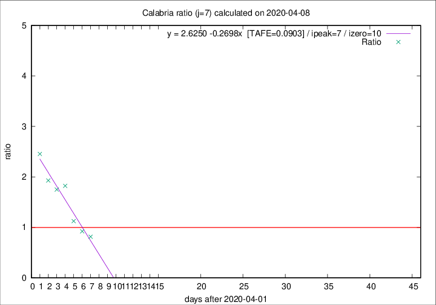

# Calabria

Data source: https://raw.githubusercontent.com/pcm-dpc/COVID-19/master/dati-json/dpc-covid19-ita-regioni.json

Delta days analysis (j): 7

Analyses for other values of j for 2020-04-08 are avalable [here](../2020-04-08/README.md)

Analyses for Calabria for previous dates are avalable [here](../README.md)

## Fitting 
|fit type|best fit equation|tafe|tfe|ipeak|izero|
|-------|-----|--------|------|---|---|
|linear|y = 2.6250 -0.2698x  [TAFE=0.0903]|0.0903|0.0077|7|10|

## Data
|Date|Daily deaths|Cumulated deaths|Deaths in the last 7 days|Deaths in the 7 days before|ratio|
|----|----------|-----------|-------|--------------------|-----|
|2020-04-08|0|60|22|27|0.8148|
|2020-04-07|2|60|24|26|0.9231|
|2020-04-06|2|58|27|24|1.1250|
|2020-04-05|7|56|31|17|1.8235|
|2020-04-04|4|49|28|16|1.7500|
|2020-04-03|4|45|27|14|1.9286|
|2020-04-02|3|41|27|11|2.4545|

[Download data as CSV](COVID-19_calabria_j7_2020-04-08.csv)

Generated April 19th, 2020 at 18:42:39 UTC+0200 with https://github.com/robianc/COVID-19
