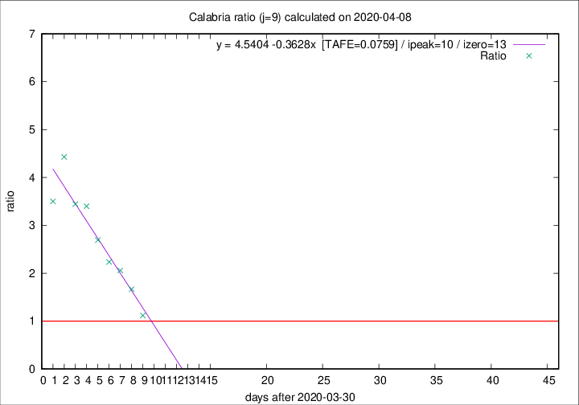

# Calabria

Data source: https://raw.githubusercontent.com/pcm-dpc/COVID-19/master/dati-json/dpc-covid19-ita-regioni.json

Delta days analysis (j): 9

Analyses for other values of j for 2020-04-08 are avalable [here](../2020-04-08/README.md)

Analyses for Calabria for previous dates are avalable [here](../README.md)

## Fitting 
|fit type|best fit equation|tafe|tfe|ipeak|izero|
|-------|-----|--------|------|---|---|
|linear|y = 4.5404 -0.3628x  [TAFE=0.0759]|0.0759|0.0150|10|13|

## Data
|Date|Daily deaths|Cumulated deaths|Deaths in the last 9 days|Deaths in the 9 days before|ratio|
|----|----------|-----------|-------|--------------------|-----|
|2020-04-08|0|60|29|26|1.1154|
|2020-04-07|2|60|35|21|1.6667|
|2020-04-06|2|58|37|18|2.0556|
|2020-04-05|7|56|38|17|2.2353|
|2020-04-04|4|49|35|13|2.6923|
|2020-04-03|4|45|34|10|3.4000|
|2020-04-02|3|41|31|9|3.4444|
|2020-04-01|2|38|31|7|4.4286|
|2020-03-31|5|36|28|8|3.5000|

[Download data as CSV](COVID-19_calabria_j9_2020-04-08.csv)

Generated April 14th, 2020 at 19:16:04 UTC+0200 with https://github.com/robianc/COVID-19
