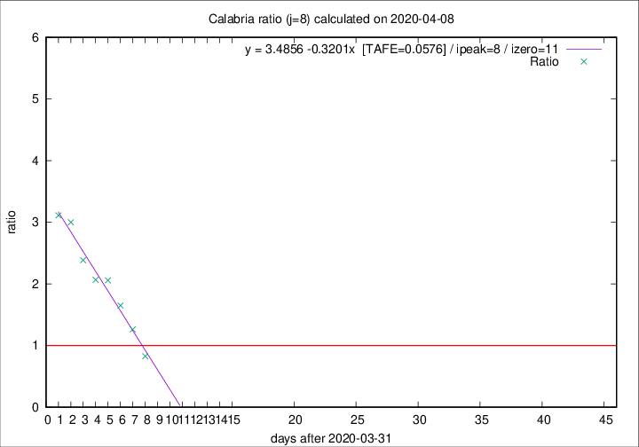

# Calabria

Data source: https://raw.githubusercontent.com/pcm-dpc/COVID-19/master/dati-json/dpc-covid19-ita-regioni.json

Estimates in this page were made on 12/4/2020 with data available until 08/04/2020.

## Summary 

### Peak estimate 
|j|linear [TAFE]|exponential [TAFE]|power law [TAFE]|details|
|---|----|-----------|---------|-------|
|7|9/4/2020 [TAFE=0.0903]|8/4/2020 [TAFE=0.0676]|9/4/2020 [TAFE=0.1289]|[analysis](COVID-19_calabria_j7_2020-04-08.md)|
|8|9/4/2020 [TAFE=0.0576]|10/4/2020 [TAFE=0.0906]|13/4/2020 [TAFE=0.1859]|[analysis](COVID-19_calabria_j8_2020-04-08.md)|
|9|10/4/2020 [TAFE=0.0759]|12/4/2020 [TAFE=0.1137]|28/4/2020 [TAFE=0.2129]|[analysis](COVID-19_calabria_j9_2020-04-08.md)|
|10|10/4/2020 [TAFE=0.1067]|13/4/2020 [TAFE=0.1047]|8/5/2020 [TAFE=0.1820]|[analysis](COVID-19_calabria_j10_2020-04-08.md)|
|11|8/4/2020 [TAFE=0.4820]|13/4/2020 [TAFE=0.1773]|29/4/2020 [TAFE=0.1422]|[analysis](COVID-19_calabria_j11_2020-04-08.md)|
|12|9/4/2020 [TAFE=0.5090]|14/4/2020 [TAFE=0.1929]|12/5/2020 [TAFE=0.2369]|[analysis](COVID-19_calabria_j12_2020-04-08.md)|
|13|-|-|-||
|14|-|-|-||

Best estimator is linear with j=8 (TAFE=0.0576)
Corresponding peak date estimate is 9/4/2020 (ipeak 8)

Peak date range estimate: 1/4/2020 - 16/5/2020

### End estimate 
|j|linear [TAFE/TFE]|exponential [TAFE/TFE]|power law [TAFE/TFE]|details|
|---|----|-----------|---------|-------|
|7|12/4/2020 [TAFE=0.0903]|-|-|[analysis](COVID-19_calabria_j7_2020-04-08.md)|
|8|12/4/2020 [TAFE=0.0576]|-|-|[analysis](COVID-19_calabria_j8_2020-04-08.md)|
|9|-|-|-|[analysis](COVID-19_calabria_j9_2020-04-08.md)|
|10|-|-|-|[analysis](COVID-19_calabria_j10_2020-04-08.md)|
|11|-|-|-|[analysis](COVID-19_calabria_j11_2020-04-08.md)|
|12|-|-|-|[analysis](COVID-19_calabria_j12_2020-04-08.md)|
|13|-|-|-||
|14|-|-|-||

Best estimator is linear with j=8 (TAFE=0.0576)
Corresponding end date estimate is 12/4/2020 (izero 11)

End date range estimate: 1/4/2020 - 14/4/2020

Generated April 12th, 2020 at 16:28:18 UTC+0200 with https://github.com/robianc/COVID-19
