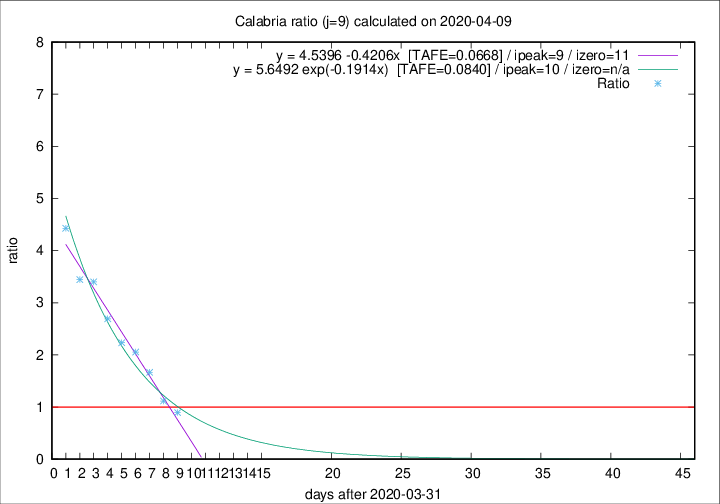

# Calabria

Data source: https://raw.githubusercontent.com/pcm-dpc/COVID-19/master/dati-json/dpc-covid19-ita-regioni.json

Delta days analysis (j): 9

Analyses for other values of j for 2020-04-09 are avalable [here](../README.md)

Analyses for Calabria for previous dates are avalable [here](../../README.md)

## Fitting 
|fit type|best fit equation|tafe|tfe|ipeak|izero|
|-------|-----|--------|------|---|---|
|linear|y = 4.5396 -0.4206x  [TAFE=0.0668]|0.0668|-0.0050|9|11|
|exp|y = 5.6492 exp(-0.1914x)  [TAFE=0.0840]|0.0840|0.0043|10|n/a|

## Data
|Date|Daily deaths|Cumulated deaths|Deaths in the last 9 days|Deaths in the 9 days before|ratio|
|----|----------|-----------|-------|--------------------|-----|
|2020-04-09|1|61|25|28|0.8929|
|2020-04-08|0|60|29|26|1.1154|
|2020-04-07|2|60|35|21|1.6667|
|2020-04-06|2|58|37|18|2.0556|
|2020-04-05|7|56|38|17|2.2353|
|2020-04-04|4|49|35|13|2.6923|
|2020-04-03|4|45|34|10|3.4000|
|2020-04-02|3|41|31|9|3.4444|
|2020-04-01|2|38|31|7|4.4286|

[Download data as CSV](COVID-19_calabria_j9_2020-04-09.csv)

Generated April 10th, 2020 at 17:26:10 UTC+0200 with https://github.com/robianc/COVID-19
