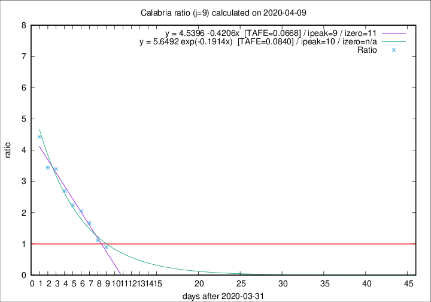

# Calabria

Data source: https://raw.githubusercontent.com/pcm-dpc/COVID-19/master/dati-json/dpc-covid19-ita-regioni.json

Estimates in this page were made on 14/4/2020 with data available until 09/04/2020.

## Summary 

### Peak estimate 
|j|linear [TAFE]|exponential [TAFE]|power law [TAFE]|details|
|---|----|-----------|---------|-------|
|7|9/4/2020 [TAFE=0.1018]|9/4/2020 [TAFE=0.0785]|8/4/2020 [TAFE=0.1232]|[analysis](COVID-19_calabria_j7_2020-04-09.md)|
|8|9/4/2020 [TAFE=0.0853]|9/4/2020 [TAFE=0.0834]|11/4/2020 [TAFE=0.1692]|[analysis](COVID-19_calabria_j8_2020-04-09.md)|
|9|10/4/2020 [TAFE=0.0668]|11/4/2020 [TAFE=0.0840]|15/4/2020 [TAFE=0.1982]|[analysis](COVID-19_calabria_j9_2020-04-09.md)|
|10|11/4/2020 [TAFE=0.0991]|12/4/2020 [TAFE=0.1217]|25/4/2020 [TAFE=0.2219]|[analysis](COVID-19_calabria_j10_2020-04-09.md)|
|11|11/4/2020 [TAFE=0.1260]|14/4/2020 [TAFE=0.0998]|5/5/2020 [TAFE=0.2031]|[analysis](COVID-19_calabria_j11_2020-04-09.md)|
|12|9/4/2020 [TAFE=0.6314]|13/4/2020 [TAFE=0.1866]|29/4/2020 [TAFE=0.1879]|[analysis](COVID-19_calabria_j12_2020-04-09.md)|
|13|10/4/2020 [TAFE=0.4896]|15/4/2020 [TAFE=0.2142]|25/5/2020 [TAFE=0.3389]|[analysis](COVID-19_calabria_j13_2020-04-09.md)|
|14|-|-|-||

Best estimator is linear with j=9 (TAFE=0.0668)
Corresponding peak date estimate is 10/4/2020 (ipeak 9)

Peak date range estimate: 1/4/2020 - 29/5/2020

### End estimate 
|j|linear [TAFE/TFE]|exponential [TAFE/TFE]|power law [TAFE/TFE]|details|
|---|----|-----------|---------|-------|
|7|13/4/2020 [TAFE=0.1018]|-|-|[analysis](COVID-19_calabria_j7_2020-04-09.md)|
|8|13/4/2020 [TAFE=0.0853]|-|-|[analysis](COVID-19_calabria_j8_2020-04-09.md)|
|9|12/4/2020 [TAFE=0.0668]|-|-|[analysis](COVID-19_calabria_j9_2020-04-09.md)|
|10|-|-|-|[analysis](COVID-19_calabria_j10_2020-04-09.md)|
|11|-|-|-|[analysis](COVID-19_calabria_j11_2020-04-09.md)|
|12|-|-|-|[analysis](COVID-19_calabria_j12_2020-04-09.md)|
|13|-|-|-|[analysis](COVID-19_calabria_j13_2020-04-09.md)|
|14|-|-|-||

Best estimator is linear with j=9 (TAFE=0.0668)
Corresponding end date estimate is 12/4/2020 (izero 11)

End date range estimate: 1/4/2020 - 14/4/2020

Generated April 14th, 2020 at 19:16:04 UTC+0200 with https://github.com/robianc/COVID-19
