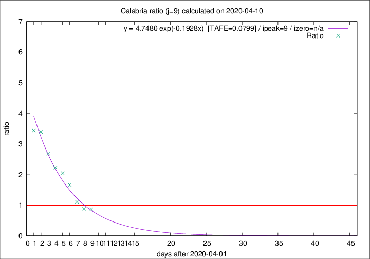

# Calabria

Data source: https://raw.githubusercontent.com/pcm-dpc/COVID-19/master/dati-json/dpc-covid19-ita-regioni.json

Estimates in this page were made on 19/4/2020 with data available until 10/04/2020.

## Summary 

### Peak estimate 
|j|linear [TAFE]|exponential [TAFE]|power law [TAFE]|details|
|---|----|-----------|---------|-------|
|7|9/4/2020 [TAFE=0.1438]|9/4/2020 [TAFE=0.1003]|8/4/2020 [TAFE=0.0821]|[analysis](COVID-19_calabria_j7_2020-04-10.md)|
|8|10/4/2020 [TAFE=0.1056]|10/4/2020 [TAFE=0.0949]|10/4/2020 [TAFE=0.1634]|[analysis](COVID-19_calabria_j8_2020-04-10.md)|
|9|10/4/2020 [TAFE=0.0865]|11/4/2020 [TAFE=0.0799]|12/4/2020 [TAFE=0.2093]|[analysis](COVID-19_calabria_j9_2020-04-10.md)|
|10|11/4/2020 [TAFE=0.1070]|12/4/2020 [TAFE=0.1411]|20/4/2020 [TAFE=0.2780]|[analysis](COVID-19_calabria_j10_2020-04-10.md)|
|11|11/4/2020 [TAFE=0.1228]|13/4/2020 [TAFE=0.1086]|26/4/2020 [TAFE=0.2269]|[analysis](COVID-19_calabria_j11_2020-04-10.md)|
|12|10/4/2020 [TAFE=0.5935]|14/4/2020 [TAFE=0.1631]|25/4/2020 [TAFE=0.1622]|[analysis](COVID-19_calabria_j12_2020-04-10.md)|
|13|10/4/2020 [TAFE=0.6512]|15/4/2020 [TAFE=0.2009]|5/5/2020 [TAFE=0.2747]|[analysis](COVID-19_calabria_j13_2020-04-10.md)|
|14|-|-|-||

Best estimator is exp with j=9 (TAFE=0.0799)
Corresponding peak date estimate is 11/4/2020 (ipeak 9)

Peak date range estimate: 2/4/2020 - 9/5/2020

### End estimate 
|j|linear [TAFE/TFE]|exponential [TAFE/TFE]|power law [TAFE/TFE]|details|
|---|----|-----------|---------|-------|
|7|14/4/2020 [TAFE=0.1438]|-|-|[analysis](COVID-19_calabria_j7_2020-04-10.md)|
|8|14/4/2020 [TAFE=0.1056]|-|-|[analysis](COVID-19_calabria_j8_2020-04-10.md)|
|9|13/4/2020 [TAFE=0.0865]|-|-|[analysis](COVID-19_calabria_j9_2020-04-10.md)|
|10|-|-|-|[analysis](COVID-19_calabria_j10_2020-04-10.md)|
|11|-|-|-|[analysis](COVID-19_calabria_j11_2020-04-10.md)|
|12|-|-|-|[analysis](COVID-19_calabria_j12_2020-04-10.md)|
|13|-|-|-|[analysis](COVID-19_calabria_j13_2020-04-10.md)|
|14|-|-|-||

Best estimator is linear with j=9 (TAFE=0.0865)
Corresponding end date estimate is 13/4/2020 (izero 11)

End date range estimate: 2/4/2020 - 15/4/2020

Generated April 19th, 2020 at 18:42:39 UTC+0200 with https://github.com/robianc/COVID-19
