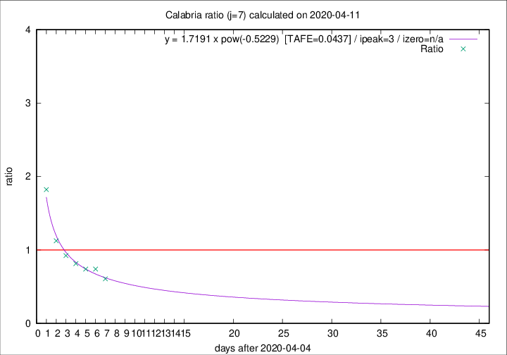

# Calabria

Data source: https://raw.githubusercontent.com/pcm-dpc/COVID-19/master/dati-json/dpc-covid19-ita-regioni.json

Estimates in this page were made on 19/4/2020 with data available until 11/04/2020.

## Summary 

### Peak estimate 
|j|linear [TAFE]|exponential [TAFE]|power law [TAFE]|details|
|---|----|-----------|---------|-------|
|7|9/4/2020 [TAFE=0.1722]|9/4/2020 [TAFE=0.1124]|8/4/2020 [TAFE=0.0437]|[analysis](COVID-19_calabria_j7_2020-04-11.md)|
|8|10/4/2020 [TAFE=0.1469]|10/4/2020 [TAFE=0.0968]|9/4/2020 [TAFE=0.1333]|[analysis](COVID-19_calabria_j8_2020-04-11.md)|
|9|11/4/2020 [TAFE=0.1449]|11/4/2020 [TAFE=0.0732]|11/4/2020 [TAFE=0.1451]|[analysis](COVID-19_calabria_j9_2020-04-11.md)|
|10|11/4/2020 [TAFE=0.1463]|12/4/2020 [TAFE=0.0892]|14/4/2020 [TAFE=0.2128]|[analysis](COVID-19_calabria_j10_2020-04-11.md)|
|11|12/4/2020 [TAFE=0.1326]|13/4/2020 [TAFE=0.1232]|20/4/2020 [TAFE=0.2742]|[analysis](COVID-19_calabria_j11_2020-04-11.md)|
|12|12/4/2020 [TAFE=0.1660]|14/4/2020 [TAFE=0.0972]|28/4/2020 [TAFE=0.2278]|[analysis](COVID-19_calabria_j12_2020-04-11.md)|
|13|10/4/2020 [TAFE=0.8006]|14/4/2020 [TAFE=0.1980]|27/4/2020 [TAFE=0.2104]|[analysis](COVID-19_calabria_j13_2020-04-11.md)|
|14|11/4/2020 [TAFE=0.6194]|16/4/2020 [TAFE=0.1784]|14/5/2020 [TAFE=0.3498]|[analysis](COVID-19_calabria_j14_2020-04-11.md)|

Best estimator is pow with j=7 (TAFE=0.0437)
Corresponding peak date estimate is 8/4/2020 (ipeak 3)

Peak date range estimate: 8/4/2020 - 21/5/2020

### End estimate 
|j|linear [TAFE/TFE]|exponential [TAFE/TFE]|power law [TAFE/TFE]|details|
|---|----|-----------|---------|-------|
|7|15/4/2020 [TAFE=0.1722]|-|-|[analysis](COVID-19_calabria_j7_2020-04-11.md)|
|8|15/4/2020 [TAFE=0.1469]|-|-|[analysis](COVID-19_calabria_j8_2020-04-11.md)|
|9|14/4/2020 [TAFE=0.1449]|-|-|[analysis](COVID-19_calabria_j9_2020-04-11.md)|
|10|-|-|-|[analysis](COVID-19_calabria_j10_2020-04-11.md)|
|11|14/4/2020 [TAFE=0.1326]|-|-|[analysis](COVID-19_calabria_j11_2020-04-11.md)|
|12|-|-|-|[analysis](COVID-19_calabria_j12_2020-04-11.md)|
|13|-|-|-|[analysis](COVID-19_calabria_j13_2020-04-11.md)|
|14|-|-|-|[analysis](COVID-19_calabria_j14_2020-04-11.md)|

Best estimator is linear with j=11 (TAFE=0.1326)
Corresponding end date estimate is 14/4/2020 (izero 13)

End date range estimate: 1/4/2020 - 14/4/2020

Generated April 19th, 2020 at 18:42:39 UTC+0200 with https://github.com/robianc/COVID-19
