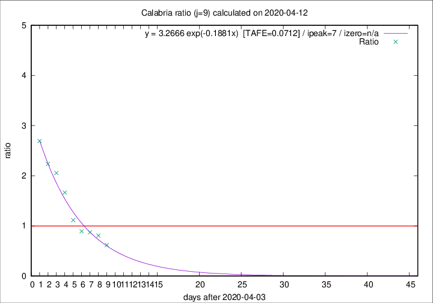

# Calabria

Data source: https://raw.githubusercontent.com/pcm-dpc/COVID-19/master/dati-json/dpc-covid19-ita-regioni.json

Delta days analysis (j): 9

Analyses for other values of j for 2020-04-12 are avalable [here](../2020-04-12/README.md)

Analyses for Calabria for previous dates are avalable [here](../README.md)

## Fitting 
|fit type|best fit equation|tafe|tfe|ipeak|izero|
|-------|-----|--------|------|---|---|
|exp|y = 3.2666 exp(-0.1881x)  [TAFE=0.0712]|0.0712|0.0045|7|n/a|

## Data
|Date|Daily deaths|Cumulated deaths|Deaths in the last 9 days|Deaths in the 9 days before|ratio|
|----|----------|-----------|-------|--------------------|-----|
|2020-04-12|0|66|21|34|0.6176|
|2020-04-11|1|66|25|31|0.8065|
|2020-04-10|4|65|27|31|0.8710|
|2020-04-09|1|61|25|28|0.8929|
|2020-04-08|0|60|29|26|1.1154|
|2020-04-07|2|60|35|21|1.6667|
|2020-04-06|2|58|37|18|2.0556|
|2020-04-05|7|56|38|17|2.2353|
|2020-04-04|4|49|35|13|2.6923|

[Download data as CSV](COVID-19_calabria_j9_2020-04-12.csv)

Generated April 16th, 2020 at 20:09:19 UTC+0200 with https://github.com/robianc/COVID-19
