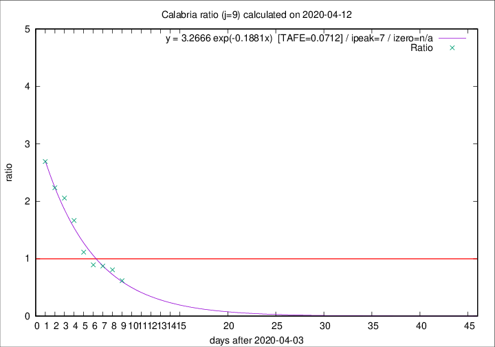

# Calabria

Data source: https://raw.githubusercontent.com/pcm-dpc/COVID-19/master/dati-json/dpc-covid19-ita-regioni.json

Estimates in this page were made on 19/4/2020 with data available until 12/04/2020.

## Summary 

### Peak estimate 
|j|linear [TAFE]|exponential [TAFE]|power law [TAFE]|details|
|---|----|-----------|---------|-------|
|7|8/4/2020 [TAFE=0.1041]|8/4/2020 [TAFE=0.1247]|8/4/2020 [TAFE=0.1724]|[analysis](COVID-19_calabria_j7_2020-04-12.md)|
|8|10/4/2020 [TAFE=0.1711]|10/4/2020 [TAFE=0.0957]|9/4/2020 [TAFE=0.0847]|[analysis](COVID-19_calabria_j8_2020-04-12.md)|
|9|11/4/2020 [TAFE=0.1514]|11/4/2020 [TAFE=0.0712]|10/4/2020 [TAFE=0.1229]|[analysis](COVID-19_calabria_j9_2020-04-12.md)|
|10|12/4/2020 [TAFE=0.1852]|12/4/2020 [TAFE=0.0875]|13/4/2020 [TAFE=0.2165]|[analysis](COVID-19_calabria_j10_2020-04-12.md)|
|11|12/4/2020 [TAFE=0.1489]|13/4/2020 [TAFE=0.1191]|17/4/2020 [TAFE=0.2987]|[analysis](COVID-19_calabria_j11_2020-04-12.md)|
|12|12/4/2020 [TAFE=0.1593]|14/4/2020 [TAFE=0.1218]|22/4/2020 [TAFE=0.2678]|[analysis](COVID-19_calabria_j12_2020-04-12.md)|
|13|11/4/2020 [TAFE=0.7595]|15/4/2020 [TAFE=0.1776]|23/4/2020 [TAFE=0.1919]|[analysis](COVID-19_calabria_j13_2020-04-12.md)|
|14|11/4/2020 [TAFE=0.8412]|16/4/2020 [TAFE=0.1689]|1/5/2020 [TAFE=0.2787]|[analysis](COVID-19_calabria_j14_2020-04-12.md)|

Best estimator is exp with j=9 (TAFE=0.0712)
Corresponding peak date estimate is 11/4/2020 (ipeak 7)

Peak date range estimate: 6/4/2020 - 6/5/2020

### End estimate 
|j|linear [TAFE/TFE]|exponential [TAFE/TFE]|power law [TAFE/TFE]|details|
|---|----|-----------|---------|-------|
|7|17/4/2020 [TAFE=0.1041]|-|-|[analysis](COVID-19_calabria_j7_2020-04-12.md)|
|8|-|-|-|[analysis](COVID-19_calabria_j8_2020-04-12.md)|
|9|-|-|-|[analysis](COVID-19_calabria_j9_2020-04-12.md)|
|10|-|-|-|[analysis](COVID-19_calabria_j10_2020-04-12.md)|
|11|-|-|-|[analysis](COVID-19_calabria_j11_2020-04-12.md)|
|12|-|-|-|[analysis](COVID-19_calabria_j12_2020-04-12.md)|
|13|-|-|-|[analysis](COVID-19_calabria_j13_2020-04-12.md)|
|14|-|-|-|[analysis](COVID-19_calabria_j14_2020-04-12.md)|

Best estimator is linear with j=7 (TAFE=0.1041)
Corresponding end date estimate is 17/4/2020 (izero 11)

End date range estimate: 6/4/2020 - 19/4/2020

Generated April 19th, 2020 at 18:42:39 UTC+0200 with https://github.com/robianc/COVID-19
