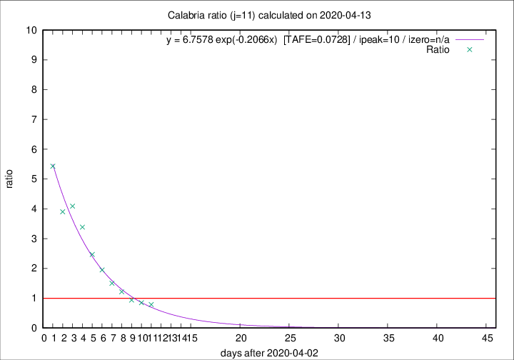

# Calabria

Data source: https://raw.githubusercontent.com/pcm-dpc/COVID-19/master/dati-json/dpc-covid19-ita-regioni.json

Delta days analysis (j): 11

Analyses for other values of j for 2020-04-13 are avalable [here](../2020-04-13/README.md)

Analyses for Calabria for previous dates are avalable [here](../README.md)

## Fitting 
|fit type|best fit equation|tafe|tfe|ipeak|izero|
|-------|-----|--------|------|---|---|
|exp|y = 6.7578 exp(-0.2066x)  [TAFE=0.0728]|0.0728|0.0037|10|n/a|

## Data
|Date|Daily deaths|Cumulated deaths|Deaths in the last 11 days|Deaths in the 11 days before|ratio|
|----|----------|-----------|-------|--------------------|-----|
|2020-04-13|1|67|26|33|0.7879|
|2020-04-12|0|66|28|33|0.8485|
|2020-04-11|1|66|30|32|0.9375|
|2020-04-10|4|65|34|28|1.2143|
|2020-04-09|1|61|36|24|1.5000|
|2020-04-08|0|60|39|20|1.9500|
|2020-04-07|2|60|42|17|2.4706|
|2020-04-06|2|58|44|13|3.3846|
|2020-04-05|7|56|45|11|4.0909|
|2020-04-04|4|49|39|10|3.9000|
|2020-04-03|4|45|38|7|5.4286|

[Download data as CSV](COVID-19_calabria_j11_2020-04-13.csv)

Generated April 16th, 2020 at 20:09:19 UTC+0200 with https://github.com/robianc/COVID-19
