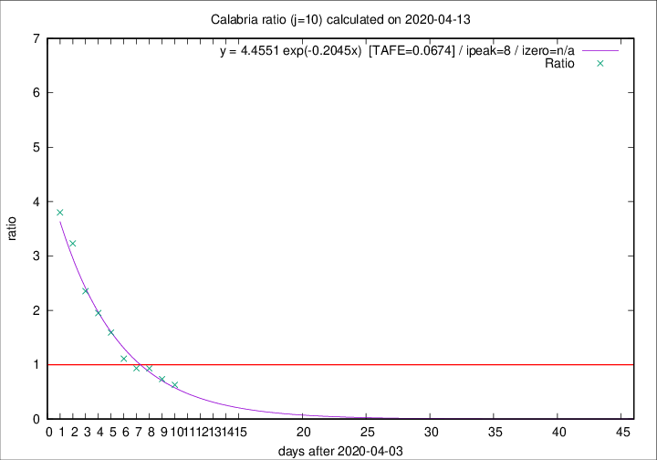

# Calabria

Data source: https://raw.githubusercontent.com/pcm-dpc/COVID-19/master/dati-json/dpc-covid19-ita-regioni.json

Estimates in this page were made on 14/4/2020 with data available until 13/04/2020.

## Summary 

### Peak estimate 
|j|linear [TAFE]|exponential [TAFE]|power law [TAFE]|details|
|---|----|-----------|---------|-------|
|7|9/4/2020 [TAFE=0.0964]|9/4/2020 [TAFE=0.1287]|9/4/2020 [TAFE=0.2084]|[analysis](COVID-19_calabria_j7_2020-04-13.md)|
|8|10/4/2020 [TAFE=0.1126]|10/4/2020 [TAFE=0.1267]|9/4/2020 [TAFE=0.1605]|[analysis](COVID-19_calabria_j8_2020-04-13.md)|
|9|11/4/2020 [TAFE=0.1652]|11/4/2020 [TAFE=0.0724]|10/4/2020 [TAFE=0.1251]|[analysis](COVID-19_calabria_j9_2020-04-13.md)|
|10|12/4/2020 [TAFE=0.2433]|12/4/2020 [TAFE=0.0674]|12/4/2020 [TAFE=0.1379]|[analysis](COVID-19_calabria_j10_2020-04-13.md)|
|11|13/4/2020 [TAFE=0.2278]|13/4/2020 [TAFE=0.0728]|14/4/2020 [TAFE=0.2080]|[analysis](COVID-19_calabria_j11_2020-04-13.md)|
|12|13/4/2020 [TAFE=0.1862]|14/4/2020 [TAFE=0.1158]|18/4/2020 [TAFE=0.3032]|[analysis](COVID-19_calabria_j12_2020-04-13.md)|
|13|13/4/2020 [TAFE=0.2516]|15/4/2020 [TAFE=0.1206]|24/4/2020 [TAFE=0.2826]|[analysis](COVID-19_calabria_j13_2020-04-13.md)|
|14|12/4/2020 [TAFE=1.0308]|15/4/2020 [TAFE=0.1703]|25/4/2020 [TAFE=0.2352]|[analysis](COVID-19_calabria_j14_2020-04-13.md)|

Best estimator is exp with j=10 (TAFE=0.0674)
Corresponding peak date estimate is 12/4/2020 (ipeak 8)

Peak date range estimate: 6/4/2020 - 29/4/2020

### End estimate 
|j|linear [TAFE/TFE]|exponential [TAFE/TFE]|power law [TAFE/TFE]|details|
|---|----|-----------|---------|-------|
|7|18/4/2020 [TAFE=0.0964]|-|-|[analysis](COVID-19_calabria_j7_2020-04-13.md)|
|8|-|-|-|[analysis](COVID-19_calabria_j8_2020-04-13.md)|
|9|-|-|-|[analysis](COVID-19_calabria_j9_2020-04-13.md)|
|10|-|-|-|[analysis](COVID-19_calabria_j10_2020-04-13.md)|
|11|-|-|-|[analysis](COVID-19_calabria_j11_2020-04-13.md)|
|12|-|-|-|[analysis](COVID-19_calabria_j12_2020-04-13.md)|
|13|-|-|-|[analysis](COVID-19_calabria_j13_2020-04-13.md)|
|14|-|-|-|[analysis](COVID-19_calabria_j14_2020-04-13.md)|

Best estimator is linear with j=7 (TAFE=0.0964)
Corresponding end date estimate is 18/4/2020 (izero 11)

End date range estimate: 7/4/2020 - 20/4/2020

Generated April 14th, 2020 at 19:16:04 UTC+0200 with https://github.com/robianc/COVID-19
