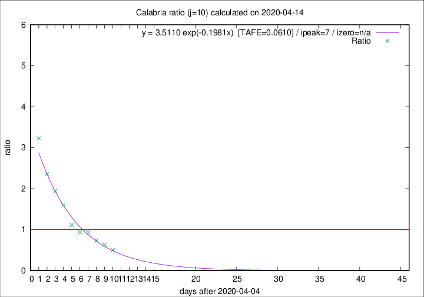

# Calabria

Data source: https://raw.githubusercontent.com/pcm-dpc/COVID-19/master/dati-json/dpc-covid19-ita-regioni.json

Estimates in this page were made on 14/4/2020 with data available until 14/04/2020.

## Summary 

### Peak estimate 
|j|linear [TAFE]|exponential [TAFE]|power law [TAFE]|details|
|---|----|-----------|---------|-------|
|7|10/4/2020 [TAFE=0.1375]|10/4/2020 [TAFE=0.1320]|10/4/2020 [TAFE=0.1793]|[analysis](COVID-19_calabria_j7_2020-04-14.md)|
|8|9/4/2020 [TAFE=0.1161]|10/4/2020 [TAFE=0.1246]|9/4/2020 [TAFE=0.2061]|[analysis](COVID-19_calabria_j8_2020-04-14.md)|
|9|11/4/2020 [TAFE=0.1605]|11/4/2020 [TAFE=0.1078]|10/4/2020 [TAFE=0.1447]|[analysis](COVID-19_calabria_j9_2020-04-14.md)|
|10|12/4/2020 [TAFE=0.2147]|12/4/2020 [TAFE=0.0610]|11/4/2020 [TAFE=0.1082]|[analysis](COVID-19_calabria_j10_2020-04-14.md)|
|11|13/4/2020 [TAFE=0.2473]|13/4/2020 [TAFE=0.0787]|13/4/2020 [TAFE=0.2058]|[analysis](COVID-19_calabria_j11_2020-04-14.md)|
|12|14/4/2020 [TAFE=0.2340]|14/4/2020 [TAFE=0.1096]|16/4/2020 [TAFE=0.3162]|[analysis](COVID-19_calabria_j12_2020-04-14.md)|
|13|14/4/2020 [TAFE=0.2525]|15/4/2020 [TAFE=0.1179]|20/4/2020 [TAFE=0.3020]|[analysis](COVID-19_calabria_j13_2020-04-14.md)|
|14|13/4/2020 [TAFE=0.9346]|15/4/2020 [TAFE=0.1503]|22/4/2020 [TAFE=0.2338]|[analysis](COVID-19_calabria_j14_2020-04-14.md)|

Best estimator is exp with j=10 (TAFE=0.0610)
Corresponding peak date estimate is 12/4/2020 (ipeak 7)

Peak date range estimate: 7/4/2020 - 26/4/2020

### End estimate 
|j|linear [TAFE/TFE]|exponential [TAFE/TFE]|power law [TAFE/TFE]|details|
|---|----|-----------|---------|-------|
|7|18/4/2020 [TAFE=0.1375]|-|-|[analysis](COVID-19_calabria_j7_2020-04-14.md)|
|8|18/4/2020 [TAFE=0.1161]|-|-|[analysis](COVID-19_calabria_j8_2020-04-14.md)|
|9|-|-|-|[analysis](COVID-19_calabria_j9_2020-04-14.md)|
|10|-|-|-|[analysis](COVID-19_calabria_j10_2020-04-14.md)|
|11|-|-|-|[analysis](COVID-19_calabria_j11_2020-04-14.md)|
|12|-|-|-|[analysis](COVID-19_calabria_j12_2020-04-14.md)|
|13|-|-|-|[analysis](COVID-19_calabria_j13_2020-04-14.md)|
|14|-|-|-|[analysis](COVID-19_calabria_j14_2020-04-14.md)|

Best estimator is linear with j=8 (TAFE=0.1161)
Corresponding end date estimate is 18/4/2020 (izero 11)

End date range estimate: 7/4/2020 - 20/4/2020

Generated April 14th, 2020 at 19:16:04 UTC+0200 with https://github.com/robianc/COVID-19
