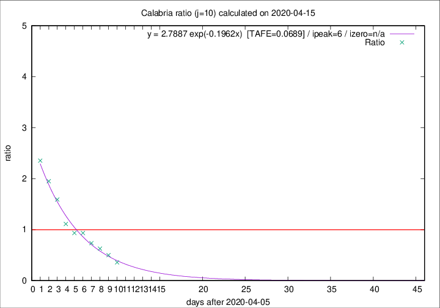

# Calabria

Data source: https://raw.githubusercontent.com/pcm-dpc/COVID-19/master/dati-json/dpc-covid19-ita-regioni.json

Estimates in this page were made on 16/4/2020 with data available until 15/04/2020.

## Summary 

### Peak estimate 
|j|linear [TAFE]|exponential [TAFE]|power law [TAFE]|details|
|---|----|-----------|---------|-------|
|7|11/4/2020 [TAFE=0.2385]|11/4/2020 [TAFE=0.2259]|11/4/2020 [TAFE=0.2115]|[analysis](COVID-19_calabria_j7_2020-04-15.md)|
|8|10/4/2020 [TAFE=0.1510]|10/4/2020 [TAFE=0.1578]|10/4/2020 [TAFE=0.2098]|[analysis](COVID-19_calabria_j8_2020-04-15.md)|
|9|11/4/2020 [TAFE=0.1312]|11/4/2020 [TAFE=0.1080]|10/4/2020 [TAFE=0.1504]|[analysis](COVID-19_calabria_j9_2020-04-15.md)|
|10|13/4/2020 [TAFE=0.1731]|12/4/2020 [TAFE=0.0689]|11/4/2020 [TAFE=0.1529]|[analysis](COVID-19_calabria_j10_2020-04-15.md)|
|11|14/4/2020 [TAFE=0.3153]|13/4/2020 [TAFE=0.0808]|12/4/2020 [TAFE=0.1283]|[analysis](COVID-19_calabria_j11_2020-04-15.md)|
|12|14/4/2020 [TAFE=0.3289]|14/4/2020 [TAFE=0.0720]|14/4/2020 [TAFE=0.2060]|[analysis](COVID-19_calabria_j12_2020-04-15.md)|
|13|14/4/2020 [TAFE=0.2968]|15/4/2020 [TAFE=0.1203]|18/4/2020 [TAFE=0.3188]|[analysis](COVID-19_calabria_j13_2020-04-15.md)|
|14|14/4/2020 [TAFE=0.3486]|16/4/2020 [TAFE=0.0907]|22/4/2020 [TAFE=0.3159]|[analysis](COVID-19_calabria_j14_2020-04-15.md)|

Best estimator is exp with j=10 (TAFE=0.0689)
Corresponding peak date estimate is 12/4/2020 (ipeak 6)

Peak date range estimate: 8/4/2020 - 26/4/2020

### End estimate 
|j|linear [TAFE/TFE]|exponential [TAFE/TFE]|power law [TAFE/TFE]|details|
|---|----|-----------|---------|-------|
|7|21/4/2020 [TAFE=0.2385]|-|-|[analysis](COVID-19_calabria_j7_2020-04-15.md)|
|8|20/4/2020 [TAFE=0.1510]|-|-|[analysis](COVID-19_calabria_j8_2020-04-15.md)|
|9|18/4/2020 [TAFE=0.1312]|-|-|[analysis](COVID-19_calabria_j9_2020-04-15.md)|
|10|-|-|-|[analysis](COVID-19_calabria_j10_2020-04-15.md)|
|11|-|-|-|[analysis](COVID-19_calabria_j11_2020-04-15.md)|
|12|-|-|-|[analysis](COVID-19_calabria_j12_2020-04-15.md)|
|13|-|-|-|[analysis](COVID-19_calabria_j13_2020-04-15.md)|
|14|-|-|-|[analysis](COVID-19_calabria_j14_2020-04-15.md)|

Best estimator is linear with j=9 (TAFE=0.1312)
Corresponding end date estimate is 18/4/2020 (izero 11)

End date range estimate: 7/4/2020 - 21/4/2020

Generated April 16th, 2020 at 20:09:19 UTC+0200 with https://github.com/robianc/COVID-19
