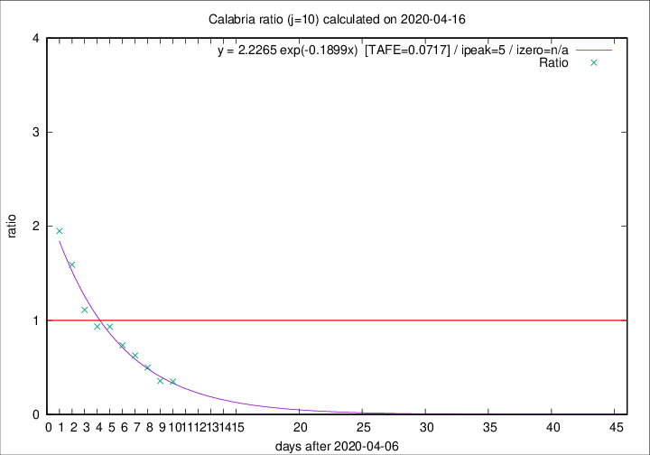

# Calabria

Data source: https://raw.githubusercontent.com/pcm-dpc/COVID-19/master/dati-json/dpc-covid19-ita-regioni.json

Estimates in this page were made on 16/4/2020 with data available until 16/04/2020.

## Summary 

### Peak estimate 
|j|linear [TAFE]|exponential [TAFE]|power law [TAFE]|details|
|---|----|-----------|---------|-------|
|7|12/4/2020 [TAFE=0.3095]|12/4/2020 [TAFE=0.2975]|12/4/2020 [TAFE=0.2646]|[analysis](COVID-19_calabria_j7_2020-04-16.md)|
|8|11/4/2020 [TAFE=0.2174]|11/4/2020 [TAFE=0.1973]|11/4/2020 [TAFE=0.2021]|[analysis](COVID-19_calabria_j8_2020-04-16.md)|
|9|10/4/2020 [TAFE=0.1175]|10/4/2020 [TAFE=0.0953]|10/4/2020 [TAFE=0.1658]|[analysis](COVID-19_calabria_j9_2020-04-16.md)|
|10|12/4/2020 [TAFE=0.1483]|12/4/2020 [TAFE=0.0717]|11/4/2020 [TAFE=0.1481]|[analysis](COVID-19_calabria_j10_2020-04-16.md)|
|11|14/4/2020 [TAFE=0.2810]|13/4/2020 [TAFE=0.0796]|12/4/2020 [TAFE=0.1379]|[analysis](COVID-19_calabria_j11_2020-04-16.md)|
|12|15/4/2020 [TAFE=0.3465]|14/4/2020 [TAFE=0.0776]|14/4/2020 [TAFE=0.1824]|[analysis](COVID-19_calabria_j12_2020-04-16.md)|
|13|15/4/2020 [TAFE=0.3430]|15/4/2020 [TAFE=0.1244]|16/4/2020 [TAFE=0.3143]|[analysis](COVID-19_calabria_j13_2020-04-16.md)|
|14|15/4/2020 [TAFE=0.3754]|16/4/2020 [TAFE=0.0904]|20/4/2020 [TAFE=0.2995]|[analysis](COVID-19_calabria_j14_2020-04-16.md)|

Best estimator is exp with j=10 (TAFE=0.0717)
Corresponding peak date estimate is 12/4/2020 (ipeak 5)

Peak date range estimate: 9/4/2020 - 24/4/2020

### End estimate 
|j|linear [TAFE/TFE]|exponential [TAFE/TFE]|power law [TAFE/TFE]|details|
|---|----|-----------|---------|-------|
|7|2/5/2020 [TAFE=0.3095]|-|-|[analysis](COVID-19_calabria_j7_2020-04-16.md)|
|8|22/4/2020 [TAFE=0.2174]|-|-|[analysis](COVID-19_calabria_j8_2020-04-16.md)|
|9|20/4/2020 [TAFE=0.1175]|-|-|[analysis](COVID-19_calabria_j9_2020-04-16.md)|
|10|-|-|-|[analysis](COVID-19_calabria_j10_2020-04-16.md)|
|11|-|-|-|[analysis](COVID-19_calabria_j11_2020-04-16.md)|
|12|-|-|-|[analysis](COVID-19_calabria_j12_2020-04-16.md)|
|13|-|-|-|[analysis](COVID-19_calabria_j13_2020-04-16.md)|
|14|-|-|-|[analysis](COVID-19_calabria_j14_2020-04-16.md)|

Best estimator is linear with j=9 (TAFE=0.1175)
Corresponding end date estimate is 20/4/2020 (izero 12)

End date range estimate: 8/4/2020 - 30/4/2020

Generated April 16th, 2020 at 20:09:19 UTC+0200 with https://github.com/robianc/COVID-19
