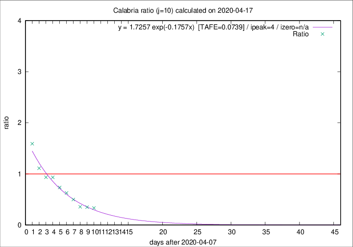

# Calabria

Data source: https://raw.githubusercontent.com/pcm-dpc/COVID-19/master/dati-json/dpc-covid19-ita-regioni.json

Delta days analysis (j): 10

Analyses for other values of j for 2020-04-17 are avalable [here](../2020-04-17/README.md)

Analyses for Calabria for previous dates are avalable [here](../README.md)

## Fitting 
|fit type|best fit equation|tafe|tfe|ipeak|izero|
|-------|-----|--------|------|---|---|
|exp|y = 1.7257 exp(-0.1757x)  [TAFE=0.0739]|0.0739|0.0041|4|n/a|

## Data
|Date|Daily deaths|Cumulated deaths|Deaths in the last 10 days|Deaths in the 10 days before|ratio|
|----|----------|-----------|-------|--------------------|-----|
|2020-04-17|1|73|13|39|0.3333|
|2020-04-16|1|72|14|40|0.3500|
|2020-04-15|3|71|15|42|0.3571|
|2020-04-14|1|68|19|38|0.5000|
|2020-04-13|1|67|22|35|0.6286|
|2020-04-12|0|66|25|34|0.7353|
|2020-04-11|1|66|28|30|0.9333|
|2020-04-10|4|65|29|31|0.9355|
|2020-04-09|1|61|30|27|1.1111|
|2020-04-08|0|60|35|22|1.5909|

[Download data as CSV](COVID-19_calabria_j10_2020-04-17.csv)

Generated April 19th, 2020 at 18:42:39 UTC+0200 with https://github.com/robianc/COVID-19
