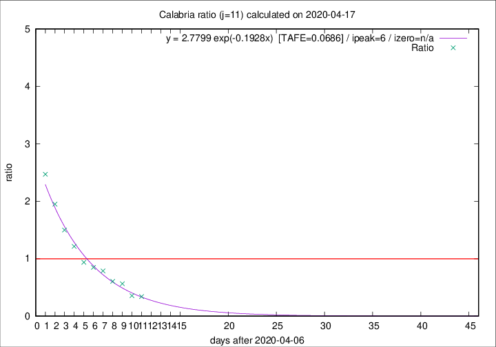
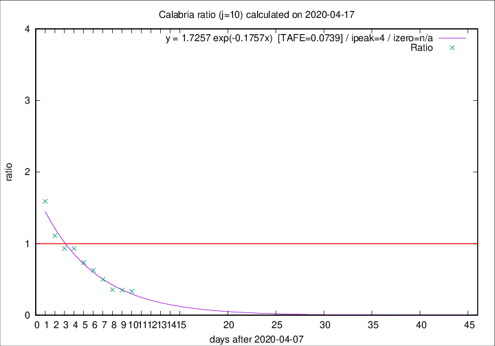

# Calabria

Data source: https://raw.githubusercontent.com/pcm-dpc/COVID-19/master/dati-json/dpc-covid19-ita-regioni.json

Estimates in this page were made on 19/4/2020 with data available until 17/04/2020.

## Summary 

### Peak estimate 
|j|linear [TAFE]|exponential [TAFE]|power law [TAFE]|details|
|---|----|-----------|---------|-------|
|7|13/4/2020 [TAFE=0.2385]|13/4/2020 [TAFE=0.2262]|13/4/2020 [TAFE=0.2256]|[analysis](COVID-19_calabria_j7_2020-04-17.md)|
|8|12/4/2020 [TAFE=0.2835]|12/4/2020 [TAFE=0.2688]|12/4/2020 [TAFE=0.2252]|[analysis](COVID-19_calabria_j8_2020-04-17.md)|
|9|11/4/2020 [TAFE=0.1714]|11/4/2020 [TAFE=0.1423]|11/4/2020 [TAFE=0.1796]|[analysis](COVID-19_calabria_j9_2020-04-17.md)|
|10|12/4/2020 [TAFE=0.1502]|12/4/2020 [TAFE=0.0739]|11/4/2020 [TAFE=0.1398]|[analysis](COVID-19_calabria_j10_2020-04-17.md)|
|11|14/4/2020 [TAFE=0.2171]|13/4/2020 [TAFE=0.0686]|12/4/2020 [TAFE=0.1643]|[analysis](COVID-19_calabria_j11_2020-04-17.md)|
|12|15/4/2020 [TAFE=0.3798]|14/4/2020 [TAFE=0.0835]|13/4/2020 [TAFE=0.1557]|[analysis](COVID-19_calabria_j12_2020-04-17.md)|
|13|15/4/2020 [TAFE=0.4607]|15/4/2020 [TAFE=0.1015]|15/4/2020 [TAFE=0.1952]|[analysis](COVID-19_calabria_j13_2020-04-17.md)|
|14|16/4/2020 [TAFE=0.4266]|16/4/2020 [TAFE=0.0911]|18/4/2020 [TAFE=0.3060]|[analysis](COVID-19_calabria_j14_2020-04-17.md)|

Best estimator is exp with j=11 (TAFE=0.0686)
Corresponding peak date estimate is 13/4/2020 (ipeak 6)

Peak date range estimate: 9/4/2020 - 21/4/2020

### End estimate 
|j|linear [TAFE/TFE]|exponential [TAFE/TFE]|power law [TAFE/TFE]|details|
|---|----|-----------|---------|-------|
|7|-|-|-|[analysis](COVID-19_calabria_j7_2020-04-17.md)|
|8|28/4/2020 [TAFE=0.2835]|-|-|[analysis](COVID-19_calabria_j8_2020-04-17.md)|
|9|22/4/2020 [TAFE=0.1714]|-|-|[analysis](COVID-19_calabria_j9_2020-04-17.md)|
|10|20/4/2020 [TAFE=0.1502]|-|-|[analysis](COVID-19_calabria_j10_2020-04-17.md)|
|11|-|-|-|[analysis](COVID-19_calabria_j11_2020-04-17.md)|
|12|-|-|-|[analysis](COVID-19_calabria_j12_2020-04-17.md)|
|13|-|-|-|[analysis](COVID-19_calabria_j13_2020-04-17.md)|
|14|-|-|-|[analysis](COVID-19_calabria_j14_2020-04-17.md)|

Best estimator is linear with j=10 (TAFE=0.1502)
Corresponding end date estimate is 20/4/2020 (izero 12)

End date range estimate: 8/4/2020 - 26/4/2020

Generated April 19th, 2020 at 18:42:39 UTC+0200 with https://github.com/robianc/COVID-19
