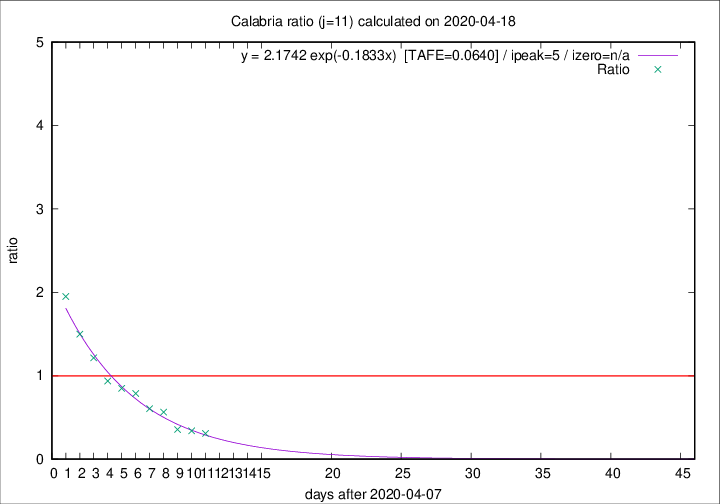

# Calabria

Data source: https://raw.githubusercontent.com/pcm-dpc/COVID-19/master/dati-json/dpc-covid19-ita-regioni.json

Estimates in this page were made on 19/4/2020 with data available until 18/04/2020.

## Summary 

### Peak estimate 
|j|linear [TAFE]|exponential [TAFE]|power law [TAFE]|details|
|---|----|-----------|---------|-------|
|7|14/4/2020 [TAFE=0.1411]|14/4/2020 [TAFE=0.1355]|14/4/2020 [TAFE=0.1299]|[analysis](COVID-19_calabria_j7_2020-04-18.md)|
|8|13/4/2020 [TAFE=0.2532]|13/4/2020 [TAFE=0.2464]|13/4/2020 [TAFE=0.2199]|[analysis](COVID-19_calabria_j8_2020-04-18.md)|
|9|12/4/2020 [TAFE=0.2484]|12/4/2020 [TAFE=0.2167]|12/4/2020 [TAFE=0.1706]|[analysis](COVID-19_calabria_j9_2020-04-18.md)|
|10|11/4/2020 [TAFE=0.1434]|11/4/2020 [TAFE=0.0886]|11/4/2020 [TAFE=0.1409]|[analysis](COVID-19_calabria_j10_2020-04-18.md)|
|11|14/4/2020 [TAFE=0.1815]|13/4/2020 [TAFE=0.0640]|12/4/2020 [TAFE=0.1682]|[analysis](COVID-19_calabria_j11_2020-04-18.md)|
|12|15/4/2020 [TAFE=0.3160]|14/4/2020 [TAFE=0.0758]|13/4/2020 [TAFE=0.1773]|[analysis](COVID-19_calabria_j12_2020-04-18.md)|
|13|16/4/2020 [TAFE=0.4392]|15/4/2020 [TAFE=0.1006]|14/4/2020 [TAFE=0.2094]|[analysis](COVID-19_calabria_j13_2020-04-18.md)|
|14|16/4/2020 [TAFE=0.4459]|16/4/2020 [TAFE=0.0948]|17/4/2020 [TAFE=0.2918]|[analysis](COVID-19_calabria_j14_2020-04-18.md)|

Best estimator is exp with j=11 (TAFE=0.0640)
Corresponding peak date estimate is 13/4/2020 (ipeak 5)

Peak date range estimate: 10/4/2020 - 20/4/2020

### End estimate 
|j|linear [TAFE/TFE]|exponential [TAFE/TFE]|power law [TAFE/TFE]|details|
|---|----|-----------|---------|-------|
|7|-|-|-|[analysis](COVID-19_calabria_j7_2020-04-18.md)|
|8|6/5/2020 [TAFE=0.2532]|-|-|[analysis](COVID-19_calabria_j8_2020-04-18.md)|
|9|25/4/2020 [TAFE=0.2484]|-|-|[analysis](COVID-19_calabria_j9_2020-04-18.md)|
|10|22/4/2020 [TAFE=0.1434]|-|-|[analysis](COVID-19_calabria_j10_2020-04-18.md)|
|11|-|-|-|[analysis](COVID-19_calabria_j11_2020-04-18.md)|
|12|-|-|-|[analysis](COVID-19_calabria_j12_2020-04-18.md)|
|13|-|-|-|[analysis](COVID-19_calabria_j13_2020-04-18.md)|
|14|-|-|-|[analysis](COVID-19_calabria_j14_2020-04-18.md)|

Best estimator is linear with j=10 (TAFE=0.1434)
Corresponding end date estimate is 22/4/2020 (izero 13)

End date range estimate: 9/4/2020 - 4/5/2020

Generated April 19th, 2020 at 18:42:39 UTC+0200 with https://github.com/robianc/COVID-19
