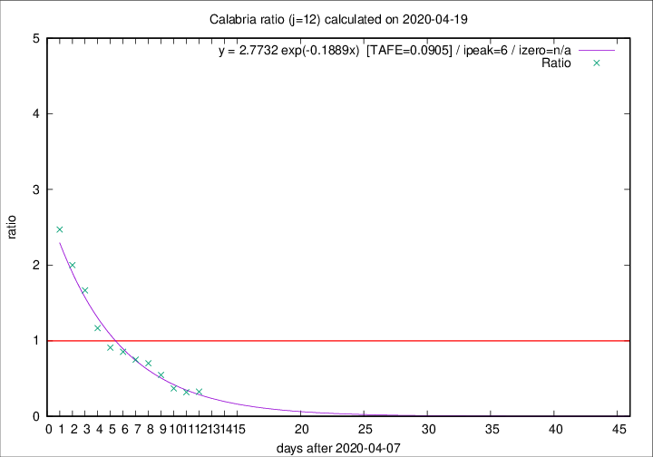

# Calabria

Data source: https://raw.githubusercontent.com/pcm-dpc/COVID-19/master/dati-json/dpc-covid19-ita-regioni.json

Delta days analysis (j): 12

Analyses for other values of j for 2020-04-19 are avalable [here](../2020-04-19/README.md)

Analyses for Calabria for previous dates are avalable [here](../README.md)

## Fitting 
|fit type|best fit equation|tafe|tfe|ipeak|izero|
|-------|-----|--------|------|---|---|
|exp|y = 2.7732 exp(-0.1889x)  [TAFE=0.0905]|0.0905|0.0049|6|n/a|

## Data
|Date|Daily deaths|Cumulated deaths|Deaths in the last 12 days|Deaths in the 12 days before|ratio|
|----|----------|-----------|-------|--------------------|-----|
|2020-04-19|2|75|15|46|0.3261|
|2020-04-18|0|73|15|47|0.3191|
|2020-04-17|1|73|17|46|0.3696|
|2020-04-16|1|72|23|42|0.5476|
|2020-04-15|3|71|26|37|0.7027|
|2020-04-14|1|68|27|36|0.7500|
|2020-04-13|1|67|29|34|0.8529|
|2020-04-12|0|66|30|33|0.9091|
|2020-04-11|1|66|35|30|1.1667|
|2020-04-10|4|65|40|24|1.6667|
|2020-04-09|1|61|40|20|2.0000|
|2020-04-08|0|60|42|17|2.4706|

[Download data as CSV](COVID-19_calabria_j12_2020-04-19.csv)

Generated April 19th, 2020 at 18:42:39 UTC+0200 with https://github.com/robianc/COVID-19
