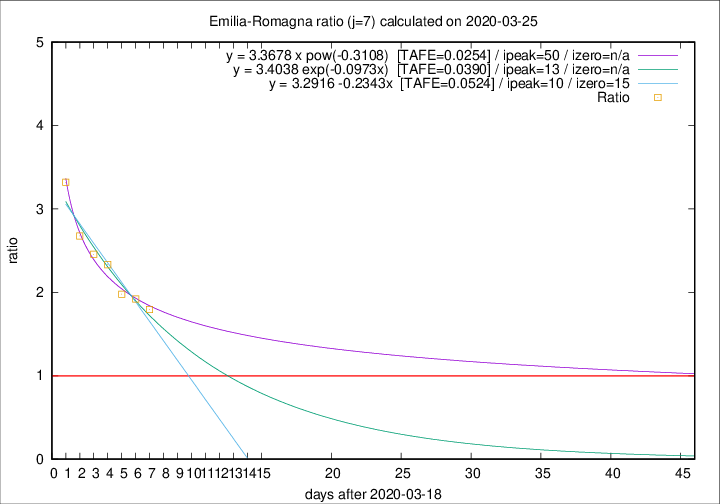

# Emilia-Romagna

Data source: https://raw.githubusercontent.com/pcm-dpc/COVID-19/master/dati-json/dpc-covid19-ita-regioni.json

Delta days analysis (j): 7

Analyses for other values of j for 2020-03-25 are avalable [here](../2020-03-25/README.md)

Analyses for Emilia-Romagna for previous dates are avalable [here](../README.md)

## Fitting 
|fit type|best fit equation|tafe|tfe|ipeak|izero|
|-------|-----|--------|------|---|---|
|linear|y = 3.2916 -0.2343x  [TAFE=0.0524]|0.0524|0.0017|10|15|
|exp|y = 3.4038 exp(-0.0973x)  [TAFE=0.0390]|0.0390|0.0009|13|n/a|
|pow|y = 3.3678 x pow(-0.3108)  [TAFE=0.0254]|0.0254|0.0005|50|n/a|

## Data
|Date|Daily deaths|Cumulated deaths|Deaths in the last 7 days|Deaths in the 7 days before|ratio|
|----|----------|-----------|-------|--------------------|-----|
|2020-03-25|92|1077|619|345|1.7942|
|2020-03-24|93|985|592|308|1.9221|
|2020-03-23|76|892|546|276|1.9783|
|2020-03-22|101|816|532|228|2.3333|
|2020-03-21|75|715|474|193|2.4560|
|2020-03-20|109|640|439|164|2.6768|
|2020-03-19|73|531|385|116|3.3190|

[Download data as CSV](COVID-19_emilia-romagna_j7_2020-03-25.csv)

Generated April 14th, 2020 at 19:16:04 UTC+0200 with https://github.com/robianc/COVID-19
