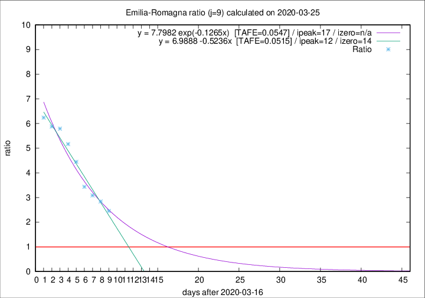

# Emilia-Romagna

Data source: https://raw.githubusercontent.com/pcm-dpc/COVID-19/master/dati-json/dpc-covid19-ita-regioni.json

Delta days analysis (j): 9

Analyses for other values of j for 2020-03-25 are avalable [here](../2020-03-25/README.md)

Analyses for Emilia-Romagna for previous dates are avalable [here](../README.md)

## Fitting 
|fit type|best fit equation|tafe|tfe|ipeak|izero|
|-------|-----|--------|------|---|---|
|linear|y = 6.9888 -0.5236x  [TAFE=0.0515]|0.0515|0.0027|12|14|
|exp|y = 7.7982 exp(-0.1265x)  [TAFE=0.0547]|0.0547|0.0018|17|n/a|

## Data
|Date|Daily deaths|Cumulated deaths|Deaths in the last 9 days|Deaths in the 9 days before|ratio|
|----|----------|-----------|-------|--------------------|-----|
|2020-03-25|92|1077|731|298|2.4530|
|2020-03-24|93|985|701|247|2.8381|
|2020-03-23|76|892|651|211|3.0853|
|2020-03-22|101|816|615|179|3.4358|
|2020-03-21|75|715|569|128|4.4453|
|2020-03-20|109|640|527|102|5.1667|
|2020-03-19|73|531|446|77|5.7922|
|2020-03-18|65|458|388|66|5.8788|
|2020-03-17|47|393|337|54|6.2407|

[Download data as CSV](COVID-19_emilia-romagna_j9_2020-03-25.csv)

Generated April 16th, 2020 at 20:09:19 UTC+0200 with https://github.com/robianc/COVID-19
