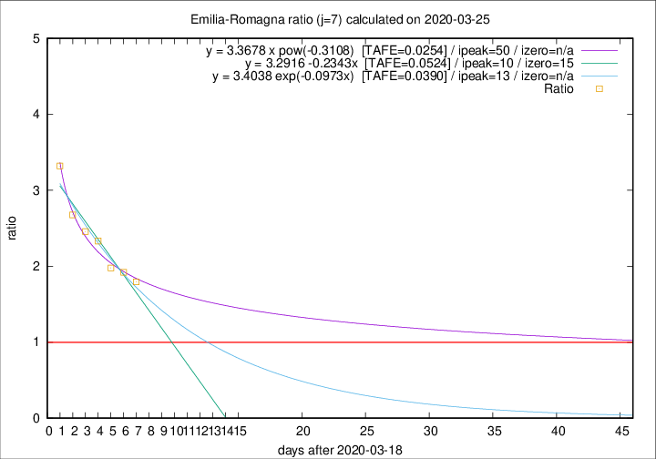
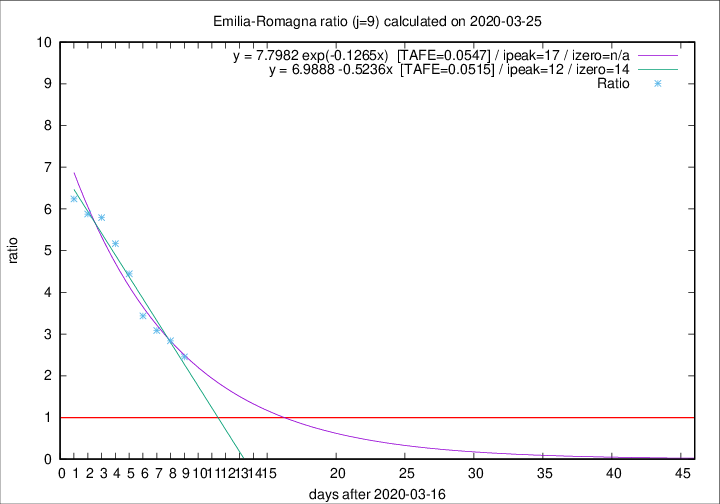

# Emilia-Romagna

Data source: https://raw.githubusercontent.com/pcm-dpc/COVID-19/master/dati-json/dpc-covid19-ita-regioni.json

Estimates in this page were made on 14/4/2020 with data available until 25/03/2020.

## Summary 

### Peak estimate 
|j|linear [TAFE]|exponential [TAFE]|power law [TAFE]|details|
|---|----|-----------|---------|-------|
|7|29/3/2020 [TAFE=0.0524]|1/4/2020 [TAFE=0.0390]|8/5/2020 [TAFE=0.0254]|[analysis](COVID-19_emilia-romagna_j7_2020-03-25.md)|
|8|28/3/2020 [TAFE=0.0643]|1/4/2020 [TAFE=0.0411]|6/5/2020 [TAFE=0.0612]|[analysis](COVID-19_emilia-romagna_j8_2020-03-25.md)|
|9|29/3/2020 [TAFE=0.0515]|3/4/2020 [TAFE=0.0547]|-|[analysis](COVID-19_emilia-romagna_j9_2020-03-25.md)|
|10|30/3/2020 [TAFE=0.0516]|6/4/2020 [TAFE=0.0799]|-|[analysis](COVID-19_emilia-romagna_j10_2020-03-25.md)|
|11|-|-|-||
|12|-|-|-||
|13|-|-|-||
|14|-|-|-||

Best estimator is pow with j=7 (TAFE=0.0254)
Corresponding peak date estimate is 8/5/2020 (ipeak 50)

Peak date range estimate: 19/3/2020 - 8/5/2020

### End estimate 
|j|linear [TAFE/TFE]|exponential [TAFE/TFE]|power law [TAFE/TFE]|details|
|---|----|-----------|---------|-------|
|7|3/4/2020 [TAFE=0.0524]|-|-|[analysis](COVID-19_emilia-romagna_j7_2020-03-25.md)|
|8|-|-|-|[analysis](COVID-19_emilia-romagna_j8_2020-03-25.md)|
|9|31/3/2020 [TAFE=0.0515]|-|-|[analysis](COVID-19_emilia-romagna_j9_2020-03-25.md)|
|10|-|-|-|[analysis](COVID-19_emilia-romagna_j10_2020-03-25.md)|
|11|-|-|-||
|12|-|-|-||
|13|-|-|-||
|14|-|-|-||

Best estimator is linear with j=9 (TAFE=0.0515)
Corresponding end date estimate is 31/3/2020 (izero 14)

End date range estimate: 17/3/2020 - 2/4/2020

Generated April 14th, 2020 at 19:16:04 UTC+0200 with https://github.com/robianc/COVID-19
