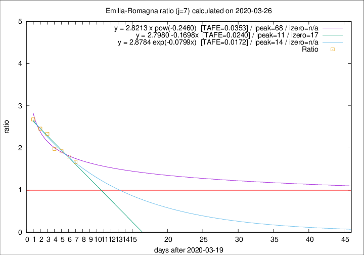

# Emilia-Romagna

Data source: https://raw.githubusercontent.com/pcm-dpc/COVID-19/master/dati-json/dpc-covid19-ita-regioni.json

Estimates in this page were made on 8/4/2020 with data available until 26/03/2020.

## Summary 

### Peak estimate 
|j|linear [TAFE]|exponential [TAFE]|power law [TAFE]|details|
|---|----|-----------|---------|-------|
|7|31/3/2020 [TAFE=0.0240]|3/4/2020 [TAFE=0.0172]|27/5/2020 [TAFE=0.0353]|[analysis](COVID-19_emilia-romagna_j7_2020-03-26.md)|
|8|29/3/2020 [TAFE=0.0812]|2/4/2020 [TAFE=0.0494]|3/5/2020 [TAFE=0.0482]|[analysis](COVID-19_emilia-romagna_j8_2020-03-26.md)|
|9|29/3/2020 [TAFE=0.0656]|3/4/2020 [TAFE=0.0496]|24/5/2020 [TAFE=0.1010]|[analysis](COVID-19_emilia-romagna_j9_2020-03-26.md)|
|10|30/3/2020 [TAFE=0.0552]|5/4/2020 [TAFE=0.0705]|-|[analysis](COVID-19_emilia-romagna_j10_2020-03-26.md)|
|11|-|-|-||
|12|-|-|-||
|13|-|-|-||
|14|-|-|-||

Best estimator is exp with j=7 (TAFE=0.0172)
Corresponding peak date estimate is 3/4/2020 (ipeak 14)

Peak date range estimate: 20/3/2020 - 27/5/2020

### End estimate 
|j|linear [TAFE/TFE]|exponential [TAFE/TFE]|power law [TAFE/TFE]|details|
|---|----|-----------|---------|-------|
|7|6/4/2020 [TAFE=0.0240]|-|-|[analysis](COVID-19_emilia-romagna_j7_2020-03-26.md)|
|8|-|-|-|[analysis](COVID-19_emilia-romagna_j8_2020-03-26.md)|
|9|-|-|-|[analysis](COVID-19_emilia-romagna_j9_2020-03-26.md)|
|10|-|-|-|[analysis](COVID-19_emilia-romagna_j10_2020-03-26.md)|
|11|-|-|-||
|12|-|-|-||
|13|-|-|-||
|14|-|-|-||

Best estimator is linear with j=7 (TAFE=0.0240)
Corresponding end date estimate is 6/4/2020 (izero 17)

End date range estimate: 20/3/2020 - 6/4/2020

Generated April 8th, 2020 at 23:43:36 UTC+0200 with https://github.com/robianc/COVID-19
