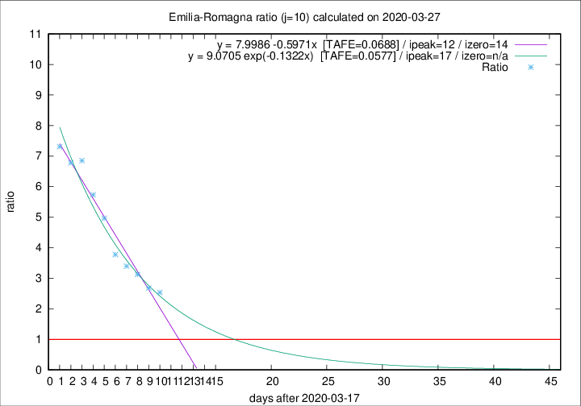

# Emilia-Romagna

Data source: https://raw.githubusercontent.com/pcm-dpc/COVID-19/master/dati-json/dpc-covid19-ita-regioni.json

Delta days analysis (j): 10

Analyses for other values of j for 2020-03-27 are avalable [here](../README.md)

Analyses for Emilia-Romagna for previous dates are avalable [here](../../README.md)

## Fitting 
|fit type|best fit equation|tafe|tfe|ipeak|izero|
|-------|-----|--------|------|---|---|
|linear|y = 7.9986 -0.5971x  [TAFE=0.0688]|0.0688|0.0016|12|14|
|exp|y = 9.0705 exp(-0.1322x)  [TAFE=0.0577]|0.0577|0.0019|17|n/a|

## Data
|Date|Daily deaths|Cumulated deaths|Deaths in the last 10 days|Deaths in the 10 days before|ratio|
|----|----------|-----------|-------|--------------------|-----|
|2020-03-27|93|1267|874|345|2.5333|
|2020-03-26|97|1174|828|309|2.6796|
|2020-03-25|92|1077|793|254|3.1220|
|2020-03-24|93|985|744|219|3.3973|
|2020-03-23|76|892|691|183|3.7760|
|2020-03-22|101|816|670|135|4.9630|
|2020-03-21|75|715|602|105|5.7333|
|2020-03-20|109|640|555|81|6.8519|
|2020-03-19|73|531|461|68|6.7794|
|2020-03-18|65|458|402|55|7.3091|

[Download data as CSV](COVID-19_emilia-romagna_j10_2020-03-27.csv)

Generated April 10th, 2020 at 17:26:10 UTC+0200 with https://github.com/robianc/COVID-19
