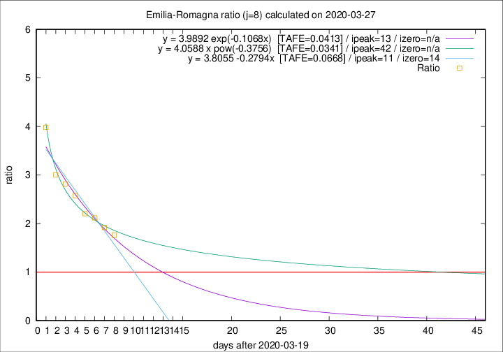

# Emilia-Romagna

Data source: https://raw.githubusercontent.com/pcm-dpc/COVID-19/master/dati-json/dpc-covid19-ita-regioni.json

Delta days analysis (j): 8

Analyses for other values of j for 2020-03-27 are avalable [here](../2020-03-27/README.md)

Analyses for Emilia-Romagna for previous dates are avalable [here](../README.md)

## Fitting 
|fit type|best fit equation|tafe|tfe|ipeak|izero|
|-------|-----|--------|------|---|---|
|linear|y = 3.8055 -0.2794x  [TAFE=0.0668]|0.0668|0.0019|11|14|
|exp|y = 3.9892 exp(-0.1068x)  [TAFE=0.0413]|0.0413|0.0014|13|n/a|
|pow|y = 4.0588 x pow(-0.3756)  [TAFE=0.0341]|0.0341|0.0008|42|n/a|

## Data
|Date|Daily deaths|Cumulated deaths|Deaths in the last 8 days|Deaths in the 8 days before|ratio|
|----|----------|-----------|-------|--------------------|-----|
|2020-03-27|93|1267|736|418|1.7608|
|2020-03-26|97|1174|716|373|1.9196|
|2020-03-25|92|1077|684|323|2.1176|
|2020-03-24|93|985|639|290|2.2034|
|2020-03-23|76|892|608|236|2.5763|
|2020-03-22|101|816|575|204|2.8186|
|2020-03-21|75|715|514|171|3.0058|
|2020-03-20|109|640|494|124|3.9839|

[Download data as CSV](COVID-19_emilia-romagna_j8_2020-03-27.csv)

Generated April 19th, 2020 at 18:42:39 UTC+0200 with https://github.com/robianc/COVID-19
