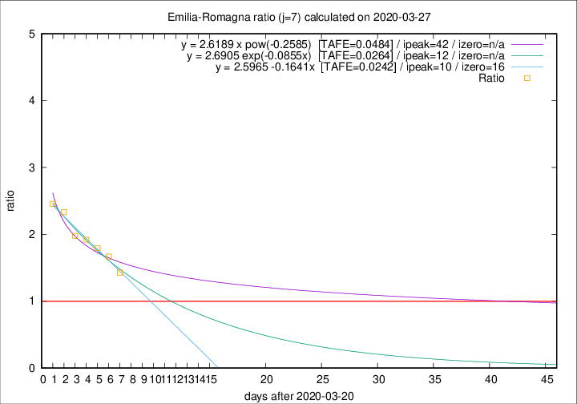

# Emilia-Romagna

Data source: https://raw.githubusercontent.com/pcm-dpc/COVID-19/master/dati-json/dpc-covid19-ita-regioni.json

Estimates in this page were made on 8/4/2020 with data available until 27/03/2020.

## Summary 

### Peak estimate 
|j|linear [TAFE]|exponential [TAFE]|power law [TAFE]|details|
|---|----|-----------|---------|-------|
|7|31/3/2020 [TAFE=0.0242]|2/4/2020 [TAFE=0.0264]|2/5/2020 [TAFE=0.0484]|[analysis](COVID-19_emilia-romagna_j7_2020-03-27.md)|
|8|31/3/2020 [TAFE=0.0668]|2/4/2020 [TAFE=0.0413]|1/5/2020 [TAFE=0.0341]|[analysis](COVID-19_emilia-romagna_j8_2020-03-27.md)|
|9|30/3/2020 [TAFE=0.0934]|3/4/2020 [TAFE=0.0496]|6/5/2020 [TAFE=0.0655]|[analysis](COVID-19_emilia-romagna_j9_2020-03-27.md)|
|10|30/3/2020 [TAFE=0.0688]|4/4/2020 [TAFE=0.0577]|10/6/2020 [TAFE=0.1276]|[analysis](COVID-19_emilia-romagna_j10_2020-03-27.md)|
|11|31/3/2020 [TAFE=0.0619]|6/4/2020 [TAFE=0.0812]|-|[analysis](COVID-19_emilia-romagna_j11_2020-03-27.md)|
|12|-|-|-||
|13|-|-|-||
|14|-|-|-||

Best estimator is linear with j=7 (TAFE=0.0242)
Corresponding peak date estimate is 31/3/2020 (ipeak 10)

Peak date range estimate: 21/3/2020 - 13/6/2020

### End estimate 
|j|linear [TAFE/TFE]|exponential [TAFE/TFE]|power law [TAFE/TFE]|details|
|---|----|-----------|---------|-------|
|7|6/4/2020 [TAFE=0.0242]|-|-|[analysis](COVID-19_emilia-romagna_j7_2020-03-27.md)|
|8|-|-|-|[analysis](COVID-19_emilia-romagna_j8_2020-03-27.md)|
|9|-|-|-|[analysis](COVID-19_emilia-romagna_j9_2020-03-27.md)|
|10|-|-|-|[analysis](COVID-19_emilia-romagna_j10_2020-03-27.md)|
|11|-|-|-|[analysis](COVID-19_emilia-romagna_j11_2020-03-27.md)|
|12|-|-|-||
|13|-|-|-||
|14|-|-|-||

Best estimator is linear with j=7 (TAFE=0.0242)
Corresponding end date estimate is 6/4/2020 (izero 16)

End date range estimate: 21/3/2020 - 6/4/2020

Generated April 8th, 2020 at 23:43:36 UTC+0200 with https://github.com/robianc/COVID-19
