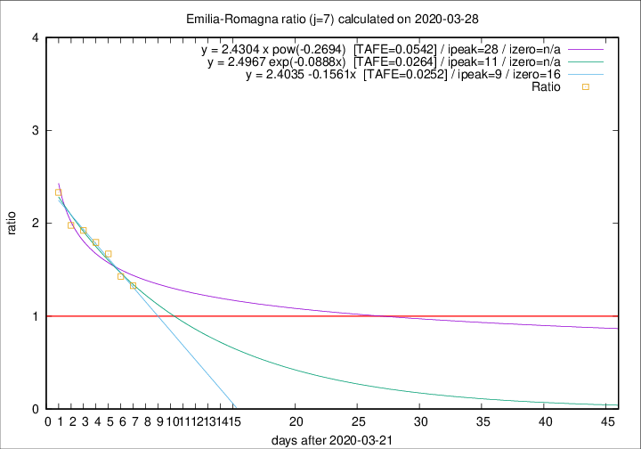

# Emilia-Romagna

Data source: https://raw.githubusercontent.com/pcm-dpc/COVID-19/master/dati-json/dpc-covid19-ita-regioni.json

Delta days analysis (j): 7

## Fitting 
|fit type|best fit equation|tafe|tfe|ipeak|izero|
|-------|-----|--------|------|---|---|
|linear|y = 2.4035 -0.1561x  [TAFE=0.0252]|0.0252|0.0008|9|16|
|exp|y = 2.4967 exp(-0.0888x)  [TAFE=0.0264]|0.0264|0.0003|11|n/a|
|pow|y = 2.4304 x pow(-0.2694)  [TAFE=0.0542]|0.0542|0.0016|28|n/a|

## Data
|Date|Daily deaths|Cumulated deaths|Deaths in the last 7 days|Deaths in the 7 days before|ratio|
|----|----------|-----------|-------|--------------------|-----|
|2020-03-28|77|1344|629|474|1.3270|
|2020-03-27|93|1267|627|439|1.4282|
|2020-03-26|97|1174|643|385|1.6701|
|2020-03-25|92|1077|619|345|1.7942|
|2020-03-24|93|985|592|308|1.9221|
|2020-03-23|76|892|546|276|1.9783|
|2020-03-22|101|816|532|228|2.3333|

[Download data as CSV](COVID-19_emilia-romagna_j7_2020-03-28.csv)

Generated April 9th, 2020 at 16:40:48 UTC+0200 with https://github.com/robianc/COVID-19
