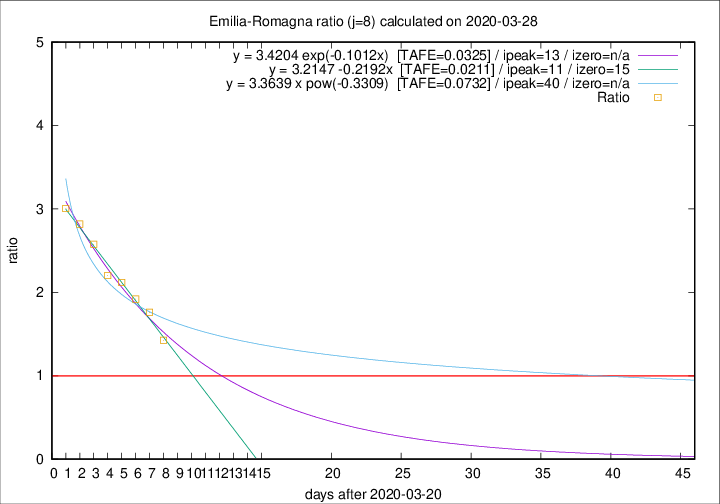

# Emilia-Romagna

Data source: https://raw.githubusercontent.com/pcm-dpc/COVID-19/master/dati-json/dpc-covid19-ita-regioni.json

Estimates in this page were made on 8/4/2020 with data available until 28/03/2020.

## Summary 

### Peak estimate 
|j|linear [TAFE]|exponential [TAFE]|power law [TAFE]|details|
|---|----|-----------|---------|-------|
|7|31/3/2020 [TAFE=0.0252]|2/4/2020 [TAFE=0.0264]|19/4/2020 [TAFE=0.0542]|[analysis](COVID-19_emilia-romagna_j7_2020-03-28.md)|
|8|1/4/2020 [TAFE=0.0211]|3/4/2020 [TAFE=0.0325]|30/4/2020 [TAFE=0.0732]|[analysis](COVID-19_emilia-romagna_j8_2020-03-28.md)|
|9|31/3/2020 [TAFE=0.0925]|3/4/2020 [TAFE=0.0488]|30/4/2020 [TAFE=0.0498]|[analysis](COVID-19_emilia-romagna_j9_2020-03-28.md)|
|10|31/3/2020 [TAFE=0.0965]|4/4/2020 [TAFE=0.0540]|16/5/2020 [TAFE=0.1066]|[analysis](COVID-19_emilia-romagna_j10_2020-03-28.md)|
|11|31/3/2020 [TAFE=0.0805]|6/4/2020 [TAFE=0.0648]|-|[analysis](COVID-19_emilia-romagna_j11_2020-03-28.md)|
|12|-|-|-||
|13|-|-|-||
|14|-|-|-||

Best estimator is linear with j=8 (TAFE=0.0211)
Corresponding peak date estimate is 1/4/2020 (ipeak 11)

Peak date range estimate: 21/3/2020 - 18/5/2020

### End estimate 
|j|linear [TAFE/TFE]|exponential [TAFE/TFE]|power law [TAFE/TFE]|details|
|---|----|-----------|---------|-------|
|7|7/4/2020 [TAFE=0.0252]|-|-|[analysis](COVID-19_emilia-romagna_j7_2020-03-28.md)|
|8|5/4/2020 [TAFE=0.0211]|-|-|[analysis](COVID-19_emilia-romagna_j8_2020-03-28.md)|
|9|-|-|-|[analysis](COVID-19_emilia-romagna_j9_2020-03-28.md)|
|10|-|-|-|[analysis](COVID-19_emilia-romagna_j10_2020-03-28.md)|
|11|-|-|-|[analysis](COVID-19_emilia-romagna_j11_2020-03-28.md)|
|12|-|-|-||
|13|-|-|-||
|14|-|-|-||

Best estimator is linear with j=8 (TAFE=0.0211)
Corresponding end date estimate is 5/4/2020 (izero 15)

End date range estimate: 21/3/2020 - 6/4/2020

Generated April 8th, 2020 at 23:43:36 UTC+0200 with https://github.com/robianc/COVID-19
