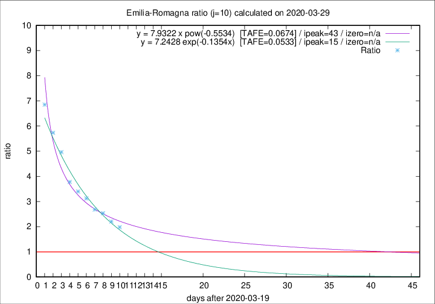

# Emilia-Romagna

Data source: https://raw.githubusercontent.com/pcm-dpc/COVID-19/master/dati-json/dpc-covid19-ita-regioni.json

Delta days analysis (j): 10

Analyses for other values of j for 2020-03-29 are avalable [here](../2020-03-29/README.md)

Analyses for Emilia-Romagna for previous dates are avalable [here](../README.md)

## Fitting 
|fit type|best fit equation|tafe|tfe|ipeak|izero|
|-------|-----|--------|------|---|---|
|exp|y = 7.2428 exp(-0.1354x)  [TAFE=0.0533]|0.0533|0.0020|15|n/a|
|pow|y = 7.9322 x pow(-0.5534)  [TAFE=0.0674]|0.0674|0.0034|43|n/a|

## Data
|Date|Daily deaths|Cumulated deaths|Deaths in the last 10 days|Deaths in the 10 days before|ratio|
|----|----------|-----------|-------|--------------------|-----|
|2020-03-29|99|1443|912|461|1.9783|
|2020-03-28|77|1344|886|402|2.2040|
|2020-03-27|93|1267|874|345|2.5333|
|2020-03-26|97|1174|828|309|2.6796|
|2020-03-25|92|1077|793|254|3.1220|
|2020-03-24|93|985|744|219|3.3973|
|2020-03-23|76|892|691|183|3.7760|
|2020-03-22|101|816|670|135|4.9630|
|2020-03-21|75|715|602|105|5.7333|
|2020-03-20|109|640|555|81|6.8519|

[Download data as CSV](COVID-19_emilia-romagna_j10_2020-03-29.csv)

Generated April 14th, 2020 at 19:16:04 UTC+0200 with https://github.com/robianc/COVID-19
