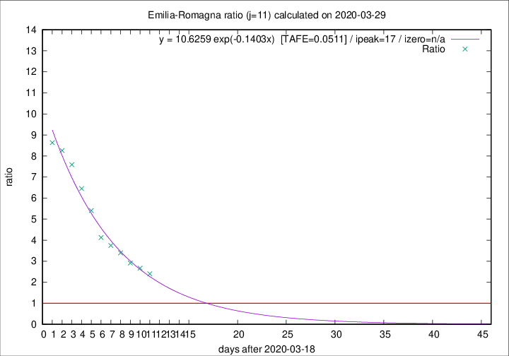

# Emilia-Romagna

Data source: https://raw.githubusercontent.com/pcm-dpc/COVID-19/master/dati-json/dpc-covid19-ita-regioni.json

Delta days analysis (j): 11

## Fitting 
|fit type|best fit equation|tafe|tfe|ipeak|izero|
|-------|-----|--------|------|---|---|
|exp|y = 10.6259 exp(-0.1403x)  [TAFE=0.0511]|0.0511|0.0017|17|n/a|

## Data
|Date|Daily deaths|Cumulated deaths|Deaths in the last 11 days|Deaths in the 11 days before|ratio|
|----|----------|-----------|-------|--------------------|-----|
|2020-03-29|99|1443|985|410|2.4024|
|2020-03-28|77|1344|951|356|2.6713|
|2020-03-27|93|1267|921|316|2.9146|
|2020-03-26|97|1174|890|262|3.3969|
|2020-03-25|92|1077|836|223|3.7489|
|2020-03-24|93|985|784|190|4.1263|
|2020-03-23|76|892|746|138|5.4058|
|2020-03-22|101|816|703|109|6.4495|
|2020-03-21|75|715|630|83|7.5904|
|2020-03-20|109|640|570|69|8.2609|
|2020-03-19|73|531|475|55|8.6364|

[Download data as CSV](COVID-19_emilia-romagna_j11_2020-03-29.csv)

Generated April 8th, 2020 at 23:43:36 UTC+0200 with https://github.com/robianc/COVID-19
