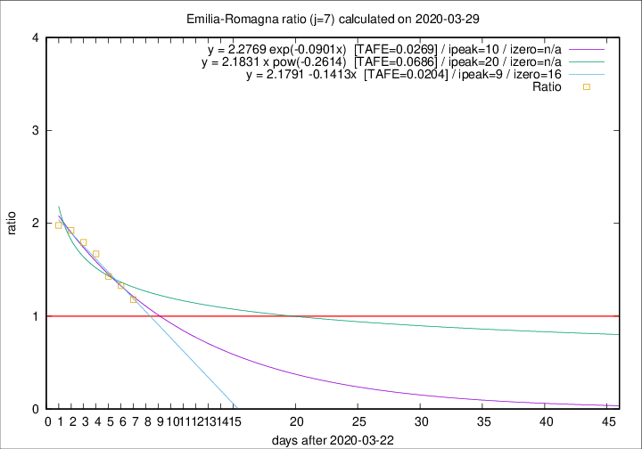

# Emilia-Romagna

Data source: https://raw.githubusercontent.com/pcm-dpc/COVID-19/master/dati-json/dpc-covid19-ita-regioni.json

Delta days analysis (j): 7

## Fitting 
|fit type|best fit equation|tafe|tfe|ipeak|izero|
|-------|-----|--------|------|---|---|
|linear|y = 2.1791 -0.1413x  [TAFE=0.0204]|0.0204|0.0008|9|16|
|exp|y = 2.2769 exp(-0.0901x)  [TAFE=0.0269]|0.0269|0.0005|10|n/a|
|pow|y = 2.1831 x pow(-0.2614)  [TAFE=0.0686]|0.0686|0.0030|20|n/a|

## Data
|Date|Daily deaths|Cumulated deaths|Deaths in the last 7 days|Deaths in the 7 days before|ratio|
|----|----------|-----------|-------|--------------------|-----|
|2020-03-29|99|1443|627|532|1.1786|
|2020-03-28|77|1344|629|474|1.3270|
|2020-03-27|93|1267|627|439|1.4282|
|2020-03-26|97|1174|643|385|1.6701|
|2020-03-25|92|1077|619|345|1.7942|
|2020-03-24|93|985|592|308|1.9221|
|2020-03-23|76|892|546|276|1.9783|

[Download data as CSV](COVID-19_emilia-romagna_j7_2020-03-29.csv)

Generated April 9th, 2020 at 16:40:48 UTC+0200 with https://github.com/robianc/COVID-19
