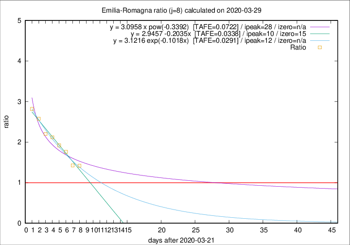

# Emilia-Romagna

Data source: https://raw.githubusercontent.com/pcm-dpc/COVID-19/master/dati-json/dpc-covid19-ita-regioni.json

Delta days analysis (j): 8

## Fitting 
|fit type|best fit equation|tafe|tfe|ipeak|izero|
|-------|-----|--------|------|---|---|
|linear|y = 2.9457 -0.2035x  [TAFE=0.0338]|0.0338|0.0008|10|15|
|exp|y = 3.1216 exp(-0.1018x)  [TAFE=0.0291]|0.0291|0.0005|12|n/a|
|pow|y = 3.0958 x pow(-0.3392)  [TAFE=0.0722]|0.0722|0.0030|28|n/a|

## Data
|Date|Daily deaths|Cumulated deaths|Deaths in the last 8 days|Deaths in the 8 days before|ratio|
|----|----------|-----------|-------|--------------------|-----|
|2020-03-29|99|1443|728|514|1.4163|
|2020-03-28|77|1344|704|494|1.4251|
|2020-03-27|93|1267|736|418|1.7608|
|2020-03-26|97|1174|716|373|1.9196|
|2020-03-25|92|1077|684|323|2.1176|
|2020-03-24|93|985|639|290|2.2034|
|2020-03-23|76|892|608|236|2.5763|
|2020-03-22|101|816|575|204|2.8186|

[Download data as CSV](COVID-19_emilia-romagna_j8_2020-03-29.csv)

Generated April 9th, 2020 at 16:40:48 UTC+0200 with https://github.com/robianc/COVID-19
