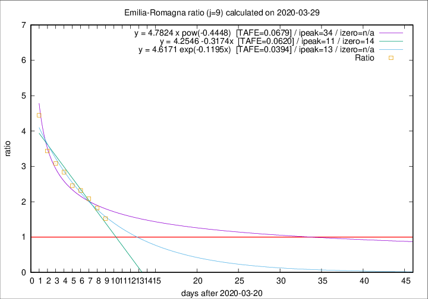

# Emilia-Romagna

Data source: https://raw.githubusercontent.com/pcm-dpc/COVID-19/master/dati-json/dpc-covid19-ita-regioni.json

Delta days analysis (j): 9

Analyses for other values of j for 2020-03-29 are avalable [here](../2020-03-29/README.md)

Analyses for Emilia-Romagna for previous dates are avalable [here](../README.md)

## Fitting 
|fit type|best fit equation|tafe|tfe|ipeak|izero|
|-------|-----|--------|------|---|---|
|linear|y = 4.2546 -0.3174x  [TAFE=0.0620]|0.0620|-0.0004|11|14|
|exp|y = 4.6171 exp(-0.1195x)  [TAFE=0.0394]|0.0394|0.0010|13|n/a|
|pow|y = 4.7824 x pow(-0.4448)  [TAFE=0.0679]|0.0679|0.0032|34|n/a|

## Data
|Date|Daily deaths|Cumulated deaths|Deaths in the last 9 days|Deaths in the 9 days before|ratio|
|----|----------|-----------|-------|--------------------|-----|
|2020-03-29|99|1443|803|527|1.5237|
|2020-03-28|77|1344|813|446|1.8229|
|2020-03-27|93|1267|809|388|2.0851|
|2020-03-26|97|1174|781|337|2.3175|
|2020-03-25|92|1077|731|298|2.4530|
|2020-03-24|93|985|701|247|2.8381|
|2020-03-23|76|892|651|211|3.0853|
|2020-03-22|101|816|615|179|3.4358|
|2020-03-21|75|715|569|128|4.4453|

[Download data as CSV](COVID-19_emilia-romagna_j9_2020-03-29.csv)

Generated April 16th, 2020 at 20:09:19 UTC+0200 with https://github.com/robianc/COVID-19
