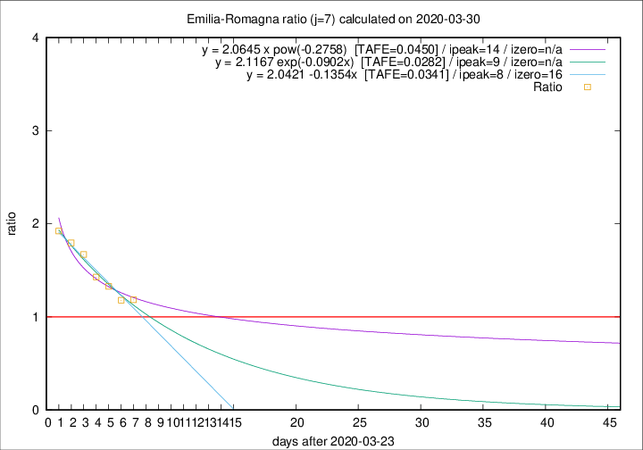

# Emilia-Romagna

Data source: https://raw.githubusercontent.com/pcm-dpc/COVID-19/master/dati-json/dpc-covid19-ita-regioni.json

Delta days analysis (j): 7

## Fitting 
|fit type|best fit equation|tafe|tfe|ipeak|izero|
|-------|-----|--------|------|---|---|
|linear|y = 2.0421 -0.1354x  [TAFE=0.0341]|0.0341|0.0009|8|16|
|exp|y = 2.1167 exp(-0.0902x)  [TAFE=0.0282]|0.0282|0.0006|9|n/a|
|pow|y = 2.0645 x pow(-0.2758)  [TAFE=0.0450]|0.0450|0.0015|14|n/a|

## Data
|Date|Daily deaths|Cumulated deaths|Deaths in the last 7 days|Deaths in the 7 days before|ratio|
|----|----------|-----------|-------|--------------------|-----|
|2020-03-30|95|1538|646|546|1.1832|
|2020-03-29|99|1443|627|532|1.1786|
|2020-03-28|77|1344|629|474|1.3270|
|2020-03-27|93|1267|627|439|1.4282|
|2020-03-26|97|1174|643|385|1.6701|
|2020-03-25|92|1077|619|345|1.7942|
|2020-03-24|93|985|592|308|1.9221|

[Download data as CSV](COVID-19_emilia-romagna_j7_2020-03-30.csv)

Generated April 9th, 2020 at 16:40:48 UTC+0200 with https://github.com/robianc/COVID-19
