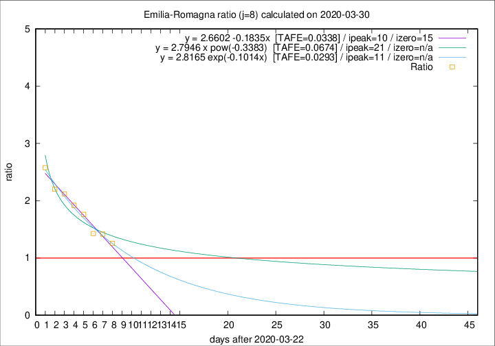

# Emilia-Romagna

Data source: https://raw.githubusercontent.com/pcm-dpc/COVID-19/master/dati-json/dpc-covid19-ita-regioni.json

Delta days analysis (j): 8

Analyses for other values of j for 2020-03-30 are avalable [here](../2020-03-30/README.md)

Analyses for Emilia-Romagna for previous dates are avalable [here](../README.md)

## Fitting 
|fit type|best fit equation|tafe|tfe|ipeak|izero|
|-------|-----|--------|------|---|---|
|linear|y = 2.6602 -0.1835x  [TAFE=0.0338]|0.0338|0.0008|10|15|
|exp|y = 2.8165 exp(-0.1014x)  [TAFE=0.0293]|0.0293|0.0005|11|n/a|
|pow|y = 2.7946 x pow(-0.3383)  [TAFE=0.0674]|0.0674|0.0028|21|n/a|

## Data
|Date|Daily deaths|Cumulated deaths|Deaths in the last 8 days|Deaths in the 8 days before|ratio|
|----|----------|-----------|-------|--------------------|-----|
|2020-03-30|95|1538|722|575|1.2557|
|2020-03-29|99|1443|728|514|1.4163|
|2020-03-28|77|1344|704|494|1.4251|
|2020-03-27|93|1267|736|418|1.7608|
|2020-03-26|97|1174|716|373|1.9196|
|2020-03-25|92|1077|684|323|2.1176|
|2020-03-24|93|985|639|290|2.2034|
|2020-03-23|76|892|608|236|2.5763|

[Download data as CSV](COVID-19_emilia-romagna_j8_2020-03-30.csv)

Generated April 14th, 2020 at 19:16:04 UTC+0200 with https://github.com/robianc/COVID-19
