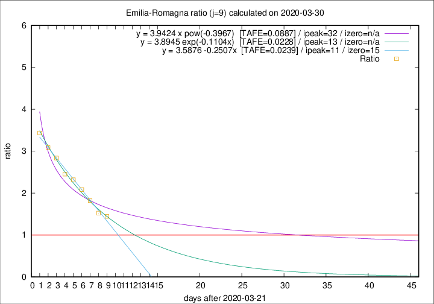

# Emilia-Romagna

Data source: https://raw.githubusercontent.com/pcm-dpc/COVID-19/master/dati-json/dpc-covid19-ita-regioni.json

Delta days analysis (j): 9

## Fitting 
|fit type|best fit equation|tafe|tfe|ipeak|izero|
|-------|-----|--------|------|---|---|
|linear|y = 3.5876 -0.2507x  [TAFE=0.0239]|0.0239|-0.0006|11|15|
|exp|y = 3.8945 exp(-0.1104x)  [TAFE=0.0228]|0.0228|0.0005|13|n/a|
|pow|y = 3.9424 x pow(-0.3967)  [TAFE=0.0887]|0.0887|0.0049|32|n/a|

## Data
|Date|Daily deaths|Cumulated deaths|Deaths in the last 9 days|Deaths in the 9 days before|ratio|
|----|----------|-----------|-------|--------------------|-----|
|2020-03-30|95|1538|823|569|1.4464|
|2020-03-29|99|1443|803|527|1.5237|
|2020-03-28|77|1344|813|446|1.8229|
|2020-03-27|93|1267|809|388|2.0851|
|2020-03-26|97|1174|781|337|2.3175|
|2020-03-25|92|1077|731|298|2.4530|
|2020-03-24|93|985|701|247|2.8381|
|2020-03-23|76|892|651|211|3.0853|
|2020-03-22|101|816|615|179|3.4358|

[Download data as CSV](COVID-19_emilia-romagna_j9_2020-03-30.csv)

Generated April 8th, 2020 at 23:43:36 UTC+0200 with https://github.com/robianc/COVID-19
