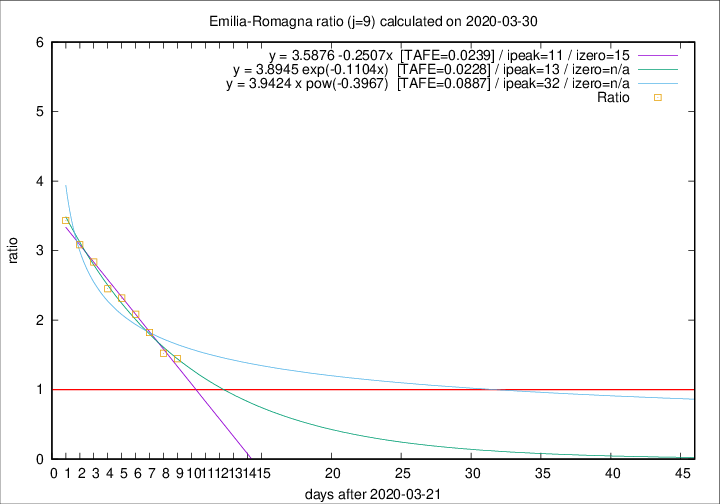

# Emilia-Romagna

Data source: https://raw.githubusercontent.com/pcm-dpc/COVID-19/master/dati-json/dpc-covid19-ita-regioni.json

Estimates in this page were made on 10/4/2020 with data available until 30/03/2020.

## Summary 

### Peak estimate 
|j|linear [TAFE]|exponential [TAFE]|power law [TAFE]|details|
|---|----|-----------|---------|-------|
|7|1/4/2020 [TAFE=0.0341]|2/4/2020 [TAFE=0.0282]|7/4/2020 [TAFE=0.0450]|[analysis](COVID-19_emilia-romagna_j7_2020-03-30.md)|
|8|2/4/2020 [TAFE=0.0338]|3/4/2020 [TAFE=0.0293]|13/4/2020 [TAFE=0.0674]|[analysis](COVID-19_emilia-romagna_j8_2020-03-30.md)|
|9|2/4/2020 [TAFE=0.0239]|4/4/2020 [TAFE=0.0228]|23/4/2020 [TAFE=0.0887]|[analysis](COVID-19_emilia-romagna_j9_2020-03-30.md)|
|10|1/4/2020 [TAFE=0.0973]|4/4/2020 [TAFE=0.0464]|26/4/2020 [TAFE=0.0776]|[analysis](COVID-19_emilia-romagna_j10_2020-03-30.md)|
|11|1/4/2020 [TAFE=0.1336]|5/4/2020 [TAFE=0.0481]|8/5/2020 [TAFE=0.1028]|[analysis](COVID-19_emilia-romagna_j11_2020-03-30.md)|
|12|1/4/2020 [TAFE=0.1216]|7/4/2020 [TAFE=0.0634]|5/6/2020 [TAFE=0.1706]|[analysis](COVID-19_emilia-romagna_j12_2020-03-30.md)|
|13|-|-|-||
|14|-|-|-||

Best estimator is exp with j=9 (TAFE=0.0228)
Corresponding peak date estimate is 4/4/2020 (ipeak 13)

Peak date range estimate: 22/3/2020 - 8/6/2020

### End estimate 
|j|linear [TAFE/TFE]|exponential [TAFE/TFE]|power law [TAFE/TFE]|details|
|---|----|-----------|---------|-------|
|7|9/4/2020 [TAFE=0.0341]|-|-|[analysis](COVID-19_emilia-romagna_j7_2020-03-30.md)|
|8|7/4/2020 [TAFE=0.0338]|-|-|[analysis](COVID-19_emilia-romagna_j8_2020-03-30.md)|
|9|6/4/2020 [TAFE=0.0239]|-|-|[analysis](COVID-19_emilia-romagna_j9_2020-03-30.md)|
|10|-|-|-|[analysis](COVID-19_emilia-romagna_j10_2020-03-30.md)|
|11|-|-|-|[analysis](COVID-19_emilia-romagna_j11_2020-03-30.md)|
|12|-|-|-|[analysis](COVID-19_emilia-romagna_j12_2020-03-30.md)|
|13|-|-|-||
|14|-|-|-||

Best estimator is linear with j=9 (TAFE=0.0239)
Corresponding end date estimate is 6/4/2020 (izero 15)

End date range estimate: 22/3/2020 - 7/4/2020

Generated April 10th, 2020 at 17:26:10 UTC+0200 with https://github.com/robianc/COVID-19
