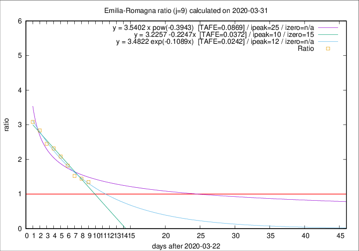
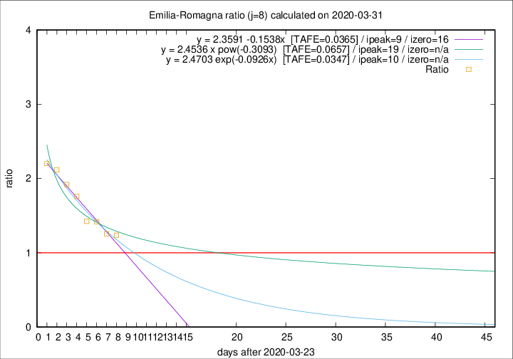

# Emilia-Romagna

Data source: https://raw.githubusercontent.com/pcm-dpc/COVID-19/master/dati-json/dpc-covid19-ita-regioni.json

Estimates in this page were made on 16/4/2020 with data available until 31/03/2020.

## Summary 

### Peak estimate 
|j|linear [TAFE]|exponential [TAFE]|power law [TAFE]|details|
|---|----|-----------|---------|-------|
|7|2/4/2020 [TAFE=0.0475]|2/4/2020 [TAFE=0.0370]|6/4/2020 [TAFE=0.0292]|[analysis](COVID-19_emilia-romagna_j7_2020-03-31.md)|
|8|2/4/2020 [TAFE=0.0365]|3/4/2020 [TAFE=0.0347]|12/4/2020 [TAFE=0.0657]|[analysis](COVID-19_emilia-romagna_j8_2020-03-31.md)|
|9|2/4/2020 [TAFE=0.0372]|4/4/2020 [TAFE=0.0242]|17/4/2020 [TAFE=0.0869]|[analysis](COVID-19_emilia-romagna_j9_2020-03-31.md)|
|10|2/4/2020 [TAFE=0.0689]|5/4/2020 [TAFE=0.0385]|23/4/2020 [TAFE=0.0830]|[analysis](COVID-19_emilia-romagna_j10_2020-03-31.md)|
|11|2/4/2020 [TAFE=0.1365]|6/4/2020 [TAFE=0.0477]|29/4/2020 [TAFE=0.0874]|[analysis](COVID-19_emilia-romagna_j11_2020-03-31.md)|
|12|2/4/2020 [TAFE=0.1599]|7/4/2020 [TAFE=0.0503]|14/5/2020 [TAFE=0.1289]|[analysis](COVID-19_emilia-romagna_j12_2020-03-31.md)|
|13|-|-|-||
|14|-|-|-||

Best estimator is exp with j=9 (TAFE=0.0242)
Corresponding peak date estimate is 4/4/2020 (ipeak 12)

Peak date range estimate: 23/3/2020 - 17/5/2020

### End estimate 
|j|linear [TAFE/TFE]|exponential [TAFE/TFE]|power law [TAFE/TFE]|details|
|---|----|-----------|---------|-------|
|7|10/4/2020 [TAFE=0.0475]|-|-|[analysis](COVID-19_emilia-romagna_j7_2020-03-31.md)|
|8|9/4/2020 [TAFE=0.0365]|-|-|[analysis](COVID-19_emilia-romagna_j8_2020-03-31.md)|
|9|-|-|-|[analysis](COVID-19_emilia-romagna_j9_2020-03-31.md)|
|10|-|-|-|[analysis](COVID-19_emilia-romagna_j10_2020-03-31.md)|
|11|-|-|-|[analysis](COVID-19_emilia-romagna_j11_2020-03-31.md)|
|12|-|-|-|[analysis](COVID-19_emilia-romagna_j12_2020-03-31.md)|
|13|-|-|-||
|14|-|-|-||

Best estimator is linear with j=8 (TAFE=0.0365)
Corresponding end date estimate is 9/4/2020 (izero 16)

End date range estimate: 24/3/2020 - 9/4/2020

Generated April 16th, 2020 at 20:09:19 UTC+0200 with https://github.com/robianc/COVID-19
