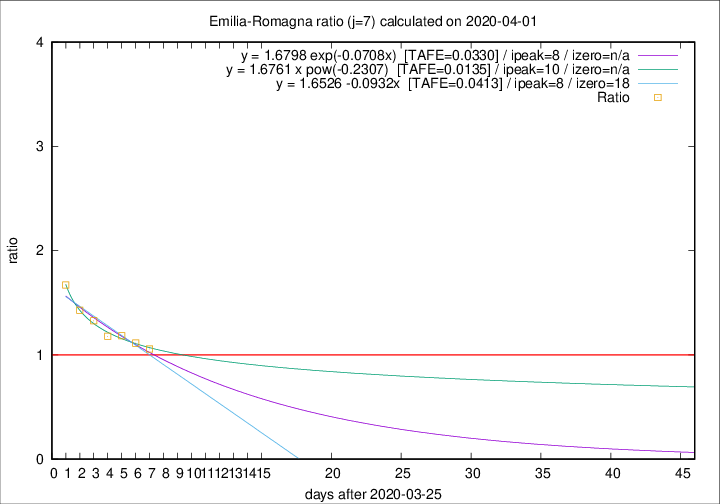

# Emilia-Romagna

Data source: https://raw.githubusercontent.com/pcm-dpc/COVID-19/master/dati-json/dpc-covid19-ita-regioni.json

Delta days analysis (j): 7

Analyses for other values of j for 2020-04-01 are avalable [here](../2020-04-01/README.md)

Analyses for Emilia-Romagna for previous dates are avalable [here](../README.md)

## Fitting 
|fit type|best fit equation|tafe|tfe|ipeak|izero|
|-------|-----|--------|------|---|---|
|linear|y = 1.6526 -0.0932x  [TAFE=0.0413]|0.0413|0.0016|8|18|
|exp|y = 1.6798 exp(-0.0708x)  [TAFE=0.0330]|0.0330|0.0008|8|n/a|
|pow|y = 1.6761 x pow(-0.2307)  [TAFE=0.0135]|0.0135|0.0002|10|n/a|

## Data
|Date|Daily deaths|Cumulated deaths|Deaths in the last 7 days|Deaths in the 7 days before|ratio|
|----|----------|-----------|-------|--------------------|-----|
|2020-04-01|88|1732|655|619|1.0582|
|2020-03-31|106|1644|659|592|1.1132|
|2020-03-30|95|1538|646|546|1.1832|
|2020-03-29|99|1443|627|532|1.1786|
|2020-03-28|77|1344|629|474|1.3270|
|2020-03-27|93|1267|627|439|1.4282|
|2020-03-26|97|1174|643|385|1.6701|

[Download data as CSV](COVID-19_emilia-romagna_j7_2020-04-01.csv)

Generated April 19th, 2020 at 18:42:39 UTC+0200 with https://github.com/robianc/COVID-19
