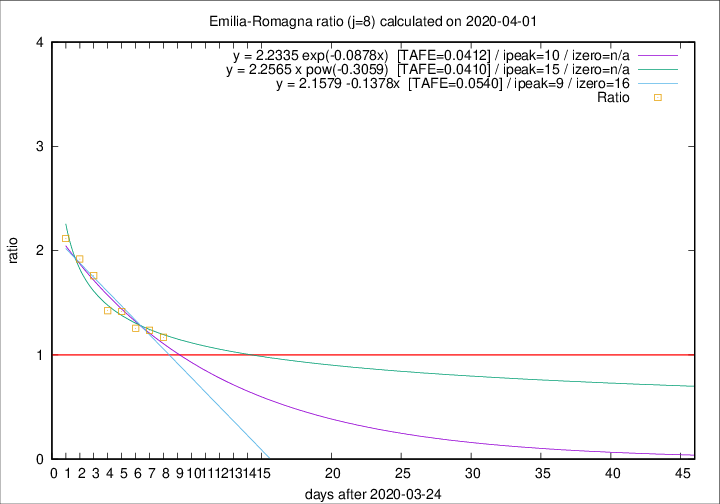

# Emilia-Romagna

Data source: https://raw.githubusercontent.com/pcm-dpc/COVID-19/master/dati-json/dpc-covid19-ita-regioni.json

Delta days analysis (j): 8

## Fitting 
|fit type|best fit equation|tafe|tfe|ipeak|izero|
|-------|-----|--------|------|---|---|
|linear|y = 2.1579 -0.1378x  [TAFE=0.0540]|0.0540|0.0022|9|16|
|exp|y = 2.2335 exp(-0.0878x)  [TAFE=0.0412]|0.0412|0.0013|10|n/a|
|pow|y = 2.2565 x pow(-0.3059)  [TAFE=0.0410]|0.0410|0.0011|15|n/a|

## Data
|Date|Daily deaths|Cumulated deaths|Deaths in the last 8 days|Deaths in the 8 days before|ratio|
|----|----------|-----------|-------|--------------------|-----|
|2020-04-01|88|1732|747|639|1.1690|
|2020-03-31|106|1644|752|608|1.2368|
|2020-03-30|95|1538|722|575|1.2557|
|2020-03-29|99|1443|728|514|1.4163|
|2020-03-28|77|1344|704|494|1.4251|
|2020-03-27|93|1267|736|418|1.7608|
|2020-03-26|97|1174|716|373|1.9196|
|2020-03-25|92|1077|684|323|2.1176|

[Download data as CSV](COVID-19_emilia-romagna_j8_2020-04-01.csv)

Generated April 8th, 2020 at 23:43:36 UTC+0200 with https://github.com/robianc/COVID-19
