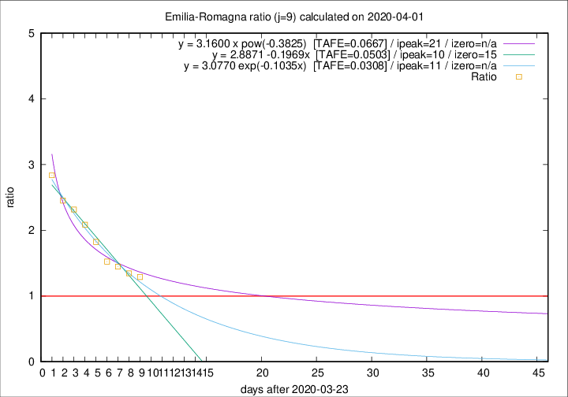

# Emilia-Romagna

Data source: https://raw.githubusercontent.com/pcm-dpc/COVID-19/master/dati-json/dpc-covid19-ita-regioni.json

Delta days analysis (j): 9

Analyses for other values of j for 2020-04-01 are avalable [here](../2020-04-01/README.md)

Analyses for Emilia-Romagna for previous dates are avalable [here](../README.md)

## Fitting 
|fit type|best fit equation|tafe|tfe|ipeak|izero|
|-------|-----|--------|------|---|---|
|linear|y = 2.8871 -0.1969x  [TAFE=0.0503]|0.0503|0.0008|10|15|
|exp|y = 3.0770 exp(-0.1035x)  [TAFE=0.0308]|0.0308|0.0007|11|n/a|
|pow|y = 3.1600 x pow(-0.3825)  [TAFE=0.0667]|0.0667|0.0028|21|n/a|

## Data
|Date|Daily deaths|Cumulated deaths|Deaths in the last 9 days|Deaths in the 9 days before|ratio|
|----|----------|-----------|-------|--------------------|-----|
|2020-04-01|88|1732|840|651|1.2903|
|2020-03-31|106|1644|828|615|1.3463|
|2020-03-30|95|1538|823|569|1.4464|
|2020-03-29|99|1443|803|527|1.5237|
|2020-03-28|77|1344|813|446|1.8229|
|2020-03-27|93|1267|809|388|2.0851|
|2020-03-26|97|1174|781|337|2.3175|
|2020-03-25|92|1077|731|298|2.4530|
|2020-03-24|93|985|701|247|2.8381|

[Download data as CSV](COVID-19_emilia-romagna_j9_2020-04-01.csv)

Generated April 16th, 2020 at 20:09:19 UTC+0200 with https://github.com/robianc/COVID-19
