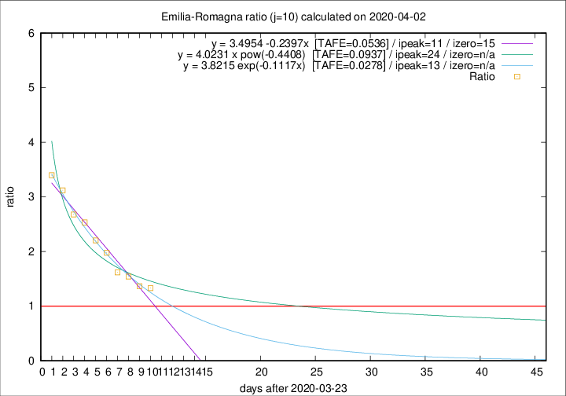

# Emilia-Romagna

Data source: https://raw.githubusercontent.com/pcm-dpc/COVID-19/master/dati-json/dpc-covid19-ita-regioni.json

Delta days analysis (j): 10

Analyses for other values of j for 2020-04-02 are avalable [here](../2020-04-02/README.md)

Analyses for Emilia-Romagna for previous dates are avalable [here](../README.md)

## Fitting 
|fit type|best fit equation|tafe|tfe|ipeak|izero|
|-------|-----|--------|------|---|---|
|linear|y = 3.4954 -0.2397x  [TAFE=0.0536]|0.0536|-0.0006|11|15|
|exp|y = 3.8215 exp(-0.1117x)  [TAFE=0.0278]|0.0278|0.0007|13|n/a|
|pow|y = 4.0231 x pow(-0.4408)  [TAFE=0.0937]|0.0937|0.0052|24|n/a|

## Data
|Date|Daily deaths|Cumulated deaths|Deaths in the last 10 days|Deaths in the 10 days before|ratio|
|----|----------|-----------|-------|--------------------|-----|
|2020-04-02|79|1811|919|691|1.3300|
|2020-04-01|88|1732|916|670|1.3672|
|2020-03-31|106|1644|929|602|1.5432|
|2020-03-30|95|1538|898|555|1.6180|
|2020-03-29|99|1443|912|461|1.9783|
|2020-03-28|77|1344|886|402|2.2040|
|2020-03-27|93|1267|874|345|2.5333|
|2020-03-26|97|1174|828|309|2.6796|
|2020-03-25|92|1077|793|254|3.1220|
|2020-03-24|93|985|744|219|3.3973|

[Download data as CSV](COVID-19_emilia-romagna_j10_2020-04-02.csv)

Generated April 12th, 2020 at 17:02:01 UTC+0200 with https://github.com/robianc/COVID-19
