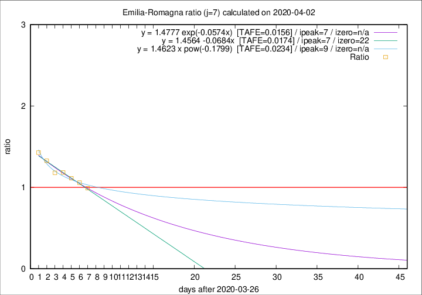

# Emilia-Romagna

Data source: https://raw.githubusercontent.com/pcm-dpc/COVID-19/master/dati-json/dpc-covid19-ita-regioni.json

Delta days analysis (j): 7

## Fitting 
|fit type|best fit equation|tafe|tfe|ipeak|izero|
|-------|-----|--------|------|---|---|
|linear|y = 1.4564 -0.0684x  [TAFE=0.0174]|0.0174|0.0006|7|22|
|exp|y = 1.4777 exp(-0.0574x)  [TAFE=0.0156]|0.0156|0.0003|7|n/a|
|pow|y = 1.4623 x pow(-0.1799)  [TAFE=0.0234]|0.0234|0.0004|9|n/a|

## Data
|Date|Daily deaths|Cumulated deaths|Deaths in the last 7 days|Deaths in the 7 days before|ratio|
|----|----------|-----------|-------|--------------------|-----|
|2020-04-02|79|1811|637|643|0.9907|
|2020-04-01|88|1732|655|619|1.0582|
|2020-03-31|106|1644|659|592|1.1132|
|2020-03-30|95|1538|646|546|1.1832|
|2020-03-29|99|1443|627|532|1.1786|
|2020-03-28|77|1344|629|474|1.3270|
|2020-03-27|93|1267|627|439|1.4282|

[Download data as CSV](COVID-19_emilia-romagna_j7_2020-04-02.csv)

Generated April 8th, 2020 at 23:43:36 UTC+0200 with https://github.com/robianc/COVID-19
