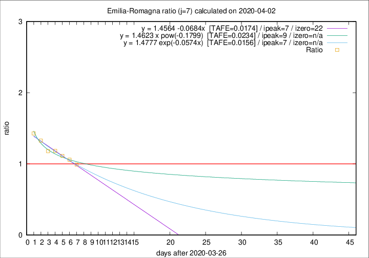

# Emilia-Romagna

Data source: https://raw.githubusercontent.com/pcm-dpc/COVID-19/master/dati-json/dpc-covid19-ita-regioni.json

Estimates in this page were made on 9/4/2020 with data available until 02/04/2020.

## Summary 

### Peak estimate 
|j|linear [TAFE]|exponential [TAFE]|power law [TAFE]|details|
|---|----|-----------|---------|-------|
|7|3/4/2020 [TAFE=0.0174]|3/4/2020 [TAFE=0.0156]|5/4/2020 [TAFE=0.0234]|[analysis](COVID-19_emilia-romagna_j7_2020-04-02.md)|
|8|4/4/2020 [TAFE=0.0522]|4/4/2020 [TAFE=0.0401]|7/4/2020 [TAFE=0.0331]|[analysis](COVID-19_emilia-romagna_j8_2020-04-02.md)|
|9|4/4/2020 [TAFE=0.0570]|5/4/2020 [TAFE=0.0345]|12/4/2020 [TAFE=0.0574]|[analysis](COVID-19_emilia-romagna_j9_2020-04-02.md)|
|10|4/4/2020 [TAFE=0.0536]|6/4/2020 [TAFE=0.0278]|17/4/2020 [TAFE=0.0937]|[analysis](COVID-19_emilia-romagna_j10_2020-04-02.md)|
|11|4/4/2020 [TAFE=0.0803]|6/4/2020 [TAFE=0.0287]|22/4/2020 [TAFE=0.1054]|[analysis](COVID-19_emilia-romagna_j11_2020-04-02.md)|
|12|3/4/2020 [TAFE=0.1630]|7/4/2020 [TAFE=0.0508]|27/4/2020 [TAFE=0.0986]|[analysis](COVID-19_emilia-romagna_j12_2020-04-02.md)|
|13|3/4/2020 [TAFE=0.2014]|8/4/2020 [TAFE=0.0512]|9/5/2020 [TAFE=0.1407]|[analysis](COVID-19_emilia-romagna_j13_2020-04-02.md)|
|14|-|-|-||

Best estimator is exp with j=7 (TAFE=0.0156)
Corresponding peak date estimate is 3/4/2020 (ipeak 7)

Peak date range estimate: 27/3/2020 - 15/5/2020

### End estimate 
|j|linear [TAFE/TFE]|exponential [TAFE/TFE]|power law [TAFE/TFE]|details|
|---|----|-----------|---------|-------|
|7|18/4/2020 [TAFE=0.0174]|-|-|[analysis](COVID-19_emilia-romagna_j7_2020-04-02.md)|
|8|-|-|-|[analysis](COVID-19_emilia-romagna_j8_2020-04-02.md)|
|9|-|-|-|[analysis](COVID-19_emilia-romagna_j9_2020-04-02.md)|
|10|-|-|-|[analysis](COVID-19_emilia-romagna_j10_2020-04-02.md)|
|11|-|-|-|[analysis](COVID-19_emilia-romagna_j11_2020-04-02.md)|
|12|-|-|-|[analysis](COVID-19_emilia-romagna_j12_2020-04-02.md)|
|13|-|-|-|[analysis](COVID-19_emilia-romagna_j13_2020-04-02.md)|
|14|-|-|-||

Best estimator is linear with j=7 (TAFE=0.0174)
Corresponding end date estimate is 18/4/2020 (izero 22)

End date range estimate: 27/3/2020 - 18/4/2020

Generated April 9th, 2020 at 16:40:48 UTC+0200 with https://github.com/robianc/COVID-19
